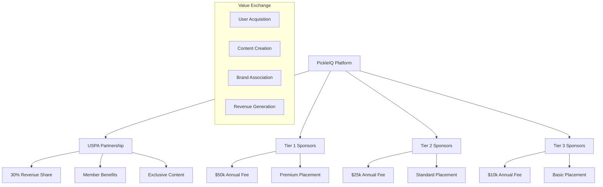

# PickleIQ Partnership Strategy

## USPA Integration & Manufacturer Sponsorship Business Model

**Document Version**: 1.0
**Created**: September 2025
**Last Updated**: September 2025
**Strategic Focus**: Revenue Growth Through Strategic Partnerships

---

## Table of Contents

1. [Partnership Overview](#partnership-overview)
2. [USPA Partnership Strategy](#uspa-partnership-strategy)
3. [Manufacturer Sponsorship Program](#manufacturer-sponsorship-program)
4. [Revenue Sharing Models](#revenue-sharing-models)
5. [Partnership Integration Requirements](#partnership-integration-requirements)
6. [Legal & Compliance Framework](#legal--compliance-framework)
7. [Partnership Analytics & Performance](#partnership-analytics--performance)
8. [Risk Management & Mitigation](#risk-management--mitigation)

---

## Partnership Overview

### Strategic Objectives

PickleIQ's partnership strategy aims to create mutually beneficial relationships that:

- **Generate Revenue**: Target $600k ARR from partnerships within 18 months
- **Enhance User Value**: Provide exclusive content, discounts, and expert coaching
- **Market Validation**: Leverage partner credibility and member bases
- **Competitive Advantage**: Create barriers to entry through exclusive partnerships
- **Scale Operations**: Access partner resources and distribution channels

### Partnership Ecosystem



### Partnership Types

| Partnership Type     | Primary Value              | Revenue Model         | Integration Level    |
| -------------------- | -------------------------- | --------------------- | -------------------- |
| **USPA Association** | Member access, credibility | Revenue sharing (30%) | Deep integration     |
| **Tier 1 Sponsors**  | Premium products, coaching | Annual fees ($50k)    | Custom integration   |
| **Tier 2 Sponsors**  | Quality equipment          | Annual fees ($25k)    | Standard integration |
| **Tier 3 Sponsors**  | Emerging brands            | Annual fees ($10k)    | Basic integration    |

---

## USPA Partnership Strategy

### Partnership Overview

The USA Pickleball Association (USPA) represents over 5 million pickleball players and is the official governing body for the sport in the United States. This partnership provides PickleIQ with:

- **Credibility**: Association with the official governing body
- **Market Access**: Direct access to 100,000+ registered USPA members
- **Content Authority**: USPA-approved coaching methodologies and standards
- **Revenue Potential**: $200k+ ARR from member subscriptions

### USPA Member Benefits

```typescript
interface USPAMemberBenefits {
  subscription_discount: {
    percentage: 25; // 25% off all subscription tiers
    code: 'USPA_MEMBER';
    verification: 'USPA member ID required';
  };

  exclusive_content: {
    coaching_standards: 'Official USPA coaching methodologies';
    tournament_prep: 'USPA-sanctioned tournament preparation';
    rule_updates: 'Latest rule changes and interpretations';
    certification_paths: 'USPA coaching certification guidance';
  };

  priority_support: {
    response_time: '24 hours or less';
    dedicated_channel: 'USPA member support portal';
    expert_access: 'Direct access to USPA-certified coaches';
  };

  community_features: {
    member_directory: 'Connect with other USPA members';
    exclusive_events: 'USPA member-only virtual coaching sessions';
    early_access: 'Beta features and new content previews';
  };
}
```

### USPA Integration Requirements

#### 1. Member Authentication & Verification

```typescript
interface USPAMemberAuth {
  member_id: string;
  membership_status: 'active' | 'expired' | 'suspended';
  membership_type: 'individual' | 'family' | 'junior' | 'coach';
  registration_date: Date;
  expiry_date: Date;
  verified_at: Date;
}

// Authentication flow
class USPAAuthService {
  async authenticateMember(credentials: USPACredentials): Promise<USPAMember> {
    // 1. Verify with USPA database
    const verification = await this.uspaAPI.verifyMember(credentials);

    // 2. Create local user profile with USPA benefits
    const user = await this.createUSPAUser(verification);

    // 3. Apply member discounts and benefits
    await this.applyMemberBenefits(user);

    // 4. Track for revenue sharing
    await this.trackUSPAMember(user);

    return user;
  }
}
```

#### 2. Coaching Certification Integration

```typescript
interface USPACertification {
  coach_id: string;
  certification_level: 'Level 1' | 'Level 2' | 'Level 3' | 'Advanced';
  specialties: string[]; // ['Youth', 'Adaptive', 'High Performance']
  issue_date: Date;
  expiry_date: Date;
  status: 'active' | 'expired' | 'suspended';
  continuing_education_credits: number;
}

// Certification verification and display
class USPACertificationService {
  async verifyCertification(coachId: string): Promise<CertificationStatus> {
    const cert = await this.uspaAPI.getCertification(coachId);

    return {
      isValid: cert.status === 'active' && cert.expiry_date > new Date(),
      level: cert.certification_level,
      displayBadge: this.generateBadgeHTML(cert),
      nextRenewal: cert.expiry_date,
      creditsNeeded: Math.max(0, 20 - cert.continuing_education_credits),
    };
  }
}
```

#### 3. USPA Content Management

```typescript
interface USPAContent {
  content_id: string;
  title: string;
  type: 'coaching_method' | 'rule_update' | 'tournament_guide' | 'certification_course';
  skill_level: string[];
  approval_status: 'approved' | 'pending' | 'rejected';
  approved_by: string; // USPA official name
  effective_date: Date;
  expiry_date?: Date;
  content_body: string;
  multimedia_assets: MediaAsset[];
  access_level: 'public' | 'member_only' | 'coach_only';
}

// Content delivery system
class USPAContentService {
  async getApprovedContent(userId: string, contentType: string): Promise<USPAContent[]> {
    // Verify user has USPA member access
    const memberStatus = await this.verifyMemberAccess(userId);

    if (!memberStatus.hasAccess) {
      return this.getPublicUSPAContent(contentType);
    }

    // Return member-exclusive content
    return this.getMemberContent(contentType, memberStatus.membershipType);
  }
}
```

### USPA Revenue Sharing Model

#### Revenue Split: 70% PickleIQ / 30% USPA

```typescript
interface USPARevenueShare {
  subscription_revenue: {
    pickleiq_share: 0.7; // 70%
    uspa_share: 0.3; // 30%
    calculation_basis: 'gross_subscription_revenue';
    exclusions: ['processing_fees', 'refunds', 'chargebacks'];
  };

  revenue_tracking: {
    member_attribution: 'USPA member ID verification';
    conversion_tracking: 'Member signup to paid subscription';
    lifetime_value: 'Track member LTV vs non-member LTV';
    churn_analysis: 'Compare member vs non-member retention';
  };

  payment_schedule: {
    frequency: 'monthly';
    payment_date: '15th of following month';
    minimum_threshold: 1000; // Minimum $1,000 before payout
    payment_method: 'ACH bank transfer';
    reporting: 'Detailed revenue report with each payment';
  };
}

// Revenue calculation and distribution
class USPARevenueService {
  async calculateMonthlyRevenue(month: string, year: number): Promise<USPARevenueSummary> {
    const period = `${year}-${month.padStart(2, '0')}`;

    // Get all USPA member subscriptions for the period
    const memberSubscriptions = await this.db.subscriptions
      .where('createdAt')
      .between(`${period}-01`, `${period}-31`)
      .and((sub) => sub.userId in this.uspaMembers)
      .toArray();

    const grossRevenue = memberSubscriptions.reduce((sum, sub) => sum + sub.amount, 0);
    const processingFees = memberSubscriptions.reduce((sum, sub) => sum + sub.processingFee, 0);
    const netRevenue = grossRevenue - processingFees;

    const uspaShare = netRevenue * 0.3;
    const pickleiqShare = netRevenue * 0.7;

    return {
      period,
      member_count: memberSubscriptions.length,
      gross_revenue: grossRevenue,
      processing_fees: processingFees,
      net_revenue: netRevenue,
      uspa_share: uspaShare,
      pickleiq_share: pickleiqShare,
      payout_date: this.calculatePayoutDate(period),
      member_breakdown: this.generateMemberBreakdown(memberSubscriptions),
    };
  }
}
```

### USPA Partnership Success Metrics

| Metric                  | Target              | Measurement Period | Tracking Method              |
| ----------------------- | ------------------- | ------------------ | ---------------------------- |
| **Member Adoption**     | 25% of USPA members | 12 months          | Member ID verification       |
| **Conversion Rate**     | 30% member to paid  | Ongoing            | Subscription tracking        |
| **Revenue Attribution** | $200k ARR           | 12 months          | Revenue sharing calculations |
| **Member Satisfaction** | >90% approval       | Quarterly surveys  | NPS scoring                  |
| **Content Engagement**  | >80% monthly usage  | Monthly            | Content analytics            |

---

## Manufacturer Sponsorship Program

### Sponsorship Tiers Overview

#### Tier 1 Sponsors - Premium Partners ($50,000/year)

**Target**: 4 major equipment manufacturers
**Expected Revenue**: $200,000 annually

**Benefits Package**:

- **Premium Product Placement**: Top positions in PickleQ equipment recommendations
- **Custom Branded Sections**: Dedicated product showcase areas throughout app
- **Sponsored Content Integration**: Product demonstrations in coaching advice
- **Exclusive Analytics Access**: Detailed user engagement and conversion metrics
- **Co-Marketing Opportunities**: Joint webinars, events, and content creation
- **API Integration**: Direct product catalog integration and real-time inventory

```typescript
interface Tier1SponsorBenefits {
  product_placement: {
    positions: ['primary_recommendation', 'featured_products', 'coaching_integration'];
    visibility: 'guaranteed_top_3_placement';
    contexts: ['equipment_advice', 'skill_improvement', 'purchase_recommendations'];
  };

  content_integration: {
    sponsored_videos: 'up_to_12_per_year';
    product_demos: 'integrated_in_coaching_advice';
    expert_interviews: 'quarterly_content_features';
    blog_posts: 'monthly_sponsored_content';
  };

  analytics_access: {
    user_demographics: 'detailed_audience_insights';
    engagement_metrics: 'click_through_rates_conversion_funnels';
    roi_tracking: 'attributed_revenue_and_conversions';
    competitive_analysis: 'performance_vs_other_sponsors';
  };

  marketing_support: {
    co_branded_campaigns: 'joint_marketing_initiatives';
    event_sponsorships: 'virtual_tournament_sponsorships';
    influencer_partnerships: 'coach_endorsement_programs';
    pr_support: 'press_release_coordination';
  };
}
```

#### Tier 2 Sponsors - Growth Partners ($25,000/year)

**Target**: 6 mid-tier equipment companies
**Expected Revenue**: $150,000 annually

**Benefits Package**:

- **Standard Product Placement**: Regular inclusion in equipment recommendations
- **Featured Product Spots**: Monthly featured product showcases
- **Content Opportunities**: Quarterly sponsored content slots
- **Basic Analytics**: Standard engagement and conversion reporting
- **Community Access**: Participation in PickleIQ community events

```typescript
interface Tier2SponsorBenefits {
  product_placement: {
    positions: ['standard_recommendation', 'category_features'];
    visibility: 'regular_rotation_placement';
    contexts: ['equipment_lists', 'skill_based_recommendations'];
  };

  content_integration: {
    sponsored_videos: 'up_to_6_per_year';
    product_features: 'monthly_product_highlights';
    comparison_inclusion: 'product_comparison_tables';
  };

  analytics_access: {
    engagement_metrics: 'basic_click_through_rates';
    conversion_tracking: 'attributed_conversions';
    quarterly_reports: 'performance_summaries';
  };

  community_integration: {
    forum_participation: 'sponsored_community_posts';
    user_reviews: 'verified_product_review_collection';
    social_features: 'product_recommendation_sharing';
  };
}
```

#### Tier 3 Sponsors - Emerging Partners ($10,000/year)

**Target**: 5 smaller or emerging companies
**Expected Revenue**: $50,000 annually

**Benefits Package**:

- **Basic Product Listing**: Inclusion in equipment databases
- **Community Presence**: Forum participation and user interaction
- **Content Submission**: Ability to submit content for approval
- **Basic Reporting**: Monthly engagement summaries

```typescript
interface Tier3SponsorBenefits {
  product_placement: {
    positions: ['category_listings', 'search_results'];
    visibility: 'equal_rotation_with_similar_products';
    contexts: ['equipment_search', 'category_browsing'];
  };

  content_integration: {
    product_submissions: 'monthly_content_submissions';
    user_generated_content: 'customer_review_features';
    community_posts: 'forum_participation';
  };

  analytics_access: {
    basic_metrics: 'monthly_summary_reports';
    conversion_tracking: 'basic_attribution';
  };

  growth_opportunities: {
    tier_upgrade_path: 'clear_metrics_for_advancement';
    performance_bonuses: 'additional_placement_for_high_performers';
    co_marketing: 'joint_social_media_opportunities';
  };
}
```

### Sponsor Integration Architecture

#### Product Catalog Integration

```typescript
interface SponsorProduct {
  product_id: string;
  sponsor_id: string;
  name: string;
  category: 'paddle' | 'ball' | 'net' | 'bag' | 'apparel' | 'accessories';
  subcategory: string;
  price: number;
  currency: string;
  availability: 'in_stock' | 'out_of_stock' | 'pre_order';
  rating: number; // 1-5 stars
  review_count: number;
  description: string;
  specifications: ProductSpecs;
  images: ProductImage[];
  videos: ProductVideo[];
  purchase_links: PurchaseLink[];
  skill_level_suitability: string[]; // ['2.0', '2.5', '3.0', etc.]
  playing_style_match: string[]; // ['power', 'control', 'balanced']
  sponsor_tier: 'tier1' | 'tier2' | 'tier3';
  placement_priority: number; // Higher number = higher placement
  promotional_tags: string[]; // ['new', 'bestseller', 'recommended']
}

// Product recommendation engine
class SponsorProductService {
  async getRecommendedProducts(userId: string, context: RecommendationContext): Promise<ProductRecommendation[]> {
    // Get user profile and preferences
    const userProfile = await this.getUserProfile(userId);

    // Get applicable products based on skill level and playing style
    const eligibleProducts = await this.getEligibleProducts(userProfile, context);

    // Apply sponsor tier weighting
    const weightedProducts = this.applyTierWeighting(eligibleProducts);

    // Apply algorithmic scoring (compatibility, reviews, etc.)
    const scoredProducts = this.scoreProducts(weightedProducts, userProfile);

    // Apply sponsor placement rules
    const finalRecommendations = this.applySponsorRules(scoredProducts);

    // Track for analytics and revenue attribution
    await this.trackRecommendations(userId, finalRecommendations);

    return finalRecommendations;
  }

  private applyTierWeighting(products: SponsorProduct[]): WeightedProduct[] {
    const tierWeights = {
      tier1: 3.0, // 3x weight
      tier2: 2.0, // 2x weight
      tier3: 1.0, // 1x weight
    };

    return products.map((product) => ({
      ...product,
      weighted_score: product.base_score * tierWeights[product.sponsor_tier],
      tier_boost: tierWeights[product.sponsor_tier],
    }));
  }

  private applySponsorRules(products: WeightedProduct[]): ProductRecommendation[] {
    // Ensure tier 1 sponsors get top 3 placement when relevant
    const tier1Products = products.filter((p) => p.sponsor_tier === 'tier1');
    const otherProducts = products.filter((p) => p.sponsor_tier !== 'tier1');

    // Guarantee tier 1 placement in top positions
    const guaranteedTier1 = tier1Products.slice(0, 3);
    const remainingSlots = 10 - guaranteedTier1.length;

    // Fill remaining slots with best-scoring products regardless of tier
    const remainingProducts = [...tier1Products.slice(3), ...otherProducts].sort((a, b) => b.weighted_score - a.weighted_score).slice(0, remainingSlots);

    return [...guaranteedTier1, ...remainingProducts].map((product) => ({
      product,
      recommendation_reason: this.generateRecommendationReason(product),
      sponsor_attribution: product.sponsor_id,
      placement_tier: product.sponsor_tier,
    }));
  }
}
```

#### Conversion Tracking & Attribution

```typescript
interface ConversionTracking {
  tracking_id: string;
  user_id: string;
  sponsor_id: string;
  product_id: string;
  recommendation_context: string;
  click_timestamp: Date;
  conversion_timestamp?: Date;
  conversion_value?: number;
  commission_rate: number;
  commission_amount: number;
  attribution_window: number; // days
  conversion_type: 'direct_click' | 'view_through' | 'assisted';
}

class SponsorAnalyticsService {
  async trackProductClick(userId: string, productId: string, sponsorId: string, context: string): Promise<void> {
    const trackingEvent = {
      tracking_id: this.generateTrackingId(),
      user_id: userId,
      sponsor_id: sponsorId,
      product_id: productId,
      recommendation_context: context,
      click_timestamp: new Date(),
      attribution_window: this.getAttributionWindow(sponsorId),
    };

    // Store for conversion attribution
    await this.db.conversionTracking.add(trackingEvent);

    // Real-time analytics update
    await this.updateSponsorMetrics(sponsorId, 'product_click', {
      product_id: productId,
      context: context,
      timestamp: new Date(),
    });
  }

  async recordConversion(trackingId: string, conversionValue: number, conversionType: string): Promise<void> {
    const tracking = await this.db.conversionTracking.get(trackingId);

    if (!tracking) {
      throw new Error(`Tracking record not found: ${trackingId}`);
    }

    // Check if conversion is within attribution window
    const hoursSinceClick = (Date.now() - tracking.click_timestamp.getTime()) / (1000 * 60 * 60);
    const attributionWindowHours = tracking.attribution_window * 24;

    if (hoursSinceClick > attributionWindowHours) {
      console.warn(`Conversion outside attribution window: ${trackingId}`);
      return;
    }

    // Calculate commission
    const commissionRate = await this.getCommissionRate(tracking.sponsor_id);
    const commissionAmount = conversionValue * commissionRate;

    // Update tracking record
    await this.db.conversionTracking.update(trackingId, {
      conversion_timestamp: new Date(),
      conversion_value: conversionValue,
      commission_rate: commissionRate,
      commission_amount: commissionAmount,
      conversion_type: conversionType,
    });

    // Update sponsor analytics
    await this.updateSponsorMetrics(tracking.sponsor_id, 'conversion', {
      conversion_value: conversionValue,
      commission_amount: commissionAmount,
      product_id: tracking.product_id,
      attribution_days: hoursSinceClick / 24,
    });

    // Update revenue sharing
    await this.recordSponsorRevenue(tracking.sponsor_id, commissionAmount);
  }
}
```

### Sponsor Onboarding Process

#### Phase 1: Initial Assessment & Agreement (Week 1)

1. **Sponsor Evaluation**:

   - Company background and market position
   - Product portfolio and quality assessment
   - Target audience alignment with PickleIQ users
   - Marketing budget and commitment level
   - Technical integration capabilities

2. **Tier Assignment**:

   - Revenue potential assessment
   - Strategic value evaluation
   - Competitive landscape analysis
   - Long-term partnership potential

3. **Contract Negotiation**:
   - Sponsorship tier agreement
   - Performance metrics and KPIs
   - Content approval processes
   - Revenue sharing terms
   - Legal compliance requirements

#### Phase 2: Technical Integration (Weeks 2-4)

1. **API Setup**:

   - Product catalog integration
   - Real-time inventory feeds
   - Pricing and availability updates
   - Image and video asset management

2. **Content Creation**:

   - Product photography and videography
   - Marketing copy and descriptions
   - Coach endorsements and reviews
   - Educational content development

3. **Testing & Quality Assurance**:
   - Product display testing
   - Conversion tracking validation
   - Analytics integration verification
   - Performance optimization

#### Phase 3: Launch & Optimization (Weeks 5-8)

1. **Soft Launch**:

   - Limited user exposure (10% traffic)
   - A/B testing of placement strategies
   - Performance monitoring and adjustment
   - User feedback collection

2. **Full Launch**:

   - Complete integration activation
   - Marketing campaign launch
   - PR and announcement coordination
   - Influencer and coach outreach

3. **Performance Optimization**:
   - Conversion rate optimization
   - Placement strategy refinement
   - Content performance analysis
   - ROI improvement initiatives

---

## Revenue Sharing Models

### USPA Revenue Distribution

```typescript
interface USPARevenueModel {
  subscription_based: {
    gross_revenue_split: {
      pickleiq: 0.7;
      uspa: 0.3;
    };
    applicable_subscriptions: ['uspa_member_subscriptions', 'uspa_referred_subscriptions'];
    exclusions: ['stripe_processing_fees', 'refunds_and_chargebacks', 'promotional_discounts'];
    minimum_payout: 1000; // $1,000 minimum monthly payout
    payment_schedule: 'monthly_on_15th';
  };

  performance_bonuses: {
    member_growth: {
      threshold: 1000; // 1,000 new USPA member signups
      bonus_percentage: 0.05; // Additional 5% revenue share
      duration: '3_months';
    };
    retention_bonus: {
      threshold: 0.9; // 90% member retention rate
      bonus_amount: 5000; // $5,000 quarterly bonus
      measurement_period: 'quarterly';
    };
  };

  content_revenue: {
    exclusive_content_premium: 0.5; // 50% for USPA exclusive content subscriptions
    certification_courses: 0.6; // 60% for USPA certification course sales
    merchandise_commissions: 0.15; // 15% commission on USPA merchandise
  };
}
```

### Sponsor Commission Structure

```typescript
interface SponsorCommissionModel {
  tier1_sponsors: {
    annual_fee: 50000;
    commission_structure: {
      direct_sales: 0.05; // 5% commission on attributed sales
      lead_generation: 50; // $50 per qualified lead
      content_engagement: 0.1; // $0.10 per content view
    };
    performance_bonuses: {
      sales_target: 100000; // $100k in attributed sales
      bonus_amount: 10000; // $10k bonus
      roi_guarantee: 2.0; // Minimum 2:1 ROI guarantee
    };
  };

  tier2_sponsors: {
    annual_fee: 25000;
    commission_structure: {
      direct_sales: 0.03; // 3% commission on attributed sales
      lead_generation: 25; // $25 per qualified lead
      content_engagement: 0.05; // $0.05 per content view
    };
    performance_bonuses: {
      sales_target: 50000; // $50k in attributed sales
      bonus_amount: 5000; // $5k bonus
      roi_target: 1.5; // Target 1.5:1 ROI
    };
  };

  tier3_sponsors: {
    annual_fee: 10000;
    commission_structure: {
      direct_sales: 0.02; // 2% commission on attributed sales
      lead_generation: 10; // $10 per qualified lead
      content_engagement: 0.02; // $0.02 per content view
    };
    growth_incentives: {
      upgrade_threshold: 25000; // $25k in attributed sales for tier upgrade
      upgrade_bonus: 2500; // $2.5k upgrade bonus
      early_renewal_discount: 0.1; // 10% discount for early renewal
    };
  };
}
```

### Revenue Forecasting & Projections

```typescript
interface RevenueProjections {
  year_1: {
    uspa_partnership: {
      member_signups: 2500;
      average_subscription: 240; // $20/month * 12 months
      gross_revenue: 600000; // 2,500 * $240
      uspa_share: 180000; // 30% of gross
      pickleiq_retention: 420000; // 70% of gross
    };

    sponsor_revenue: {
      tier1_sponsors: {
        count: 3;
        annual_fees: 150000; // 3 * $50k
        commission_revenue: 15000; // Estimated commissions
        total: 165000;
      };
      tier2_sponsors: {
        count: 4;
        annual_fees: 100000; // 4 * $25k
        commission_revenue: 8000; // Estimated commissions
        total: 108000;
      };
      tier3_sponsors: {
        count: 3;
        annual_fees: 30000; // 3 * $10k
        commission_revenue: 3000; // Estimated commissions
        total: 33000;
      };
      total_sponsor_revenue: 306000;
    };

    total_partnership_revenue: 486000; // USPA retention + Sponsor total
    revenue_growth_target: 0.15; // 15% month-over-month growth
  };

  year_2_projections: {
    uspa_partnership: {
      member_signups: 5000; // 100% growth
      average_subscription: 280; // Price increase + premium features
      gross_revenue: 1400000;
      uspa_share: 420000;
      pickleiq_retention: 980000;
    };

    sponsor_revenue: {
      tier1_sponsors: {
        count: 4;
        annual_fees: 200000;
        commission_revenue: 40000;
        total: 240000;
      };
      tier2_sponsors: {
        count: 6;
        annual_fees: 150000;
        commission_revenue: 25000;
        total: 175000;
      };
      tier3_sponsors: {
        count: 5;
        annual_fees: 50000;
        commission_revenue: 10000;
        total: 60000;
      };
      total_sponsor_revenue: 475000;
    };

    total_partnership_revenue: 1455000;
    growth_rate: 2.99; // 199% year-over-year growth
  };
}
```

---

## Partnership Integration Requirements

### Technical Integration Standards

#### API Requirements

```typescript
// Standardized Partner API Interface
interface PartnerAPIStandards {
  authentication: {
    method: 'OAuth2' | 'API_Key' | 'JWT';
    security: 'TLS_1_3_minimum';
    rate_limiting: 'per_partner_limits';
    monitoring: 'real_time_health_checks';
  };

  data_formats: {
    request_format: 'JSON';
    response_format: 'JSON';
    error_handling: 'RFC7807_compliant';
    versioning: 'semantic_versioning';
  };

  performance_requirements: {
    response_time: '< 2_seconds_95th_percentile';
    availability: '99.9%_uptime';
    throughput: '1000_requests_per_minute';
    data_freshness: '< 15_minutes_for_critical_data';
  };

  compliance: {
    data_privacy: 'GDPR_CCPA_compliant';
    security: 'SOC2_Type2_certified';
    uptime_sla: '99.9%_monthly_availability';
    data_retention: 'partner_specific_policies';
  };
}

// USPA API Integration Specifications
interface USPAAPIRequirements {
  member_verification: {
    endpoint: 'POST /api/v1/members/verify';
    request_data: {
      member_id: string;
      email: string;
      verification_token?: string;
    };
    response_data: {
      is_valid: boolean;
      member_details: USPAMemberDetails;
      membership_status: MembershipStatus;
      benefits_eligible: string[];
    };
    rate_limit: '100_requests_per_minute';
    caching: '5_minutes_member_status';
  };

  certification_lookup: {
    endpoint: 'GET /api/v1/certifications/{coach_id}';
    response_data: {
      certifications: CertificationDetails[];
      status: 'active' | 'expired' | 'suspended';
      renewal_date: Date;
      specialties: string[];
    };
    rate_limit: '50_requests_per_minute';
    caching: '1_hour_certification_status';
  };

  content_delivery: {
    endpoint: 'GET /api/v1/content/{content_type}';
    authentication: 'required_for_member_content';
    response_data: {
      content: USPAContent[];
      access_level: 'public' | 'member' | 'coach';
      last_modified: Date;
      version: string;
    };
    rate_limit: '200_requests_per_minute';
    caching: '4_hours_content_cache';
  };
}

// Sponsor API Integration Specifications
interface SponsorAPIRequirements {
  product_catalog: {
    endpoint: 'GET /api/v1/products';
    query_parameters: {
      category?: string;
      skill_level?: string;
      price_range?: string;
      availability?: 'in_stock' | 'all';
    };
    response_data: {
      products: SponsorProduct[];
      total_count: number;
      pagination: PaginationInfo;
      last_updated: Date;
    };
    rate_limit: '500_requests_per_minute';
    caching: '15_minutes_product_data';
  };

  inventory_updates: {
    endpoint: 'POST /api/v1/inventory/webhook';
    webhook_data: {
      product_id: string;
      availability: 'in_stock' | 'out_of_stock' | 'low_stock';
      quantity?: number;
      price_changes?: PriceChange[];
      effective_date: Date;
    };
    security: 'webhook_signature_verification';
    processing: 'real_time_inventory_updates';
  };

  conversion_tracking: {
    endpoint: 'POST /api/v1/conversions';
    request_data: {
      tracking_id: string;
      product_id: string;
      conversion_value: number;
      currency: string;
      conversion_type: string;
      timestamp: Date;
    };
    response_data: {
      commission_amount: number;
      commission_rate: number;
      tracking_status: 'confirmed' | 'pending' | 'rejected';
    };
    rate_limit: '1000_requests_per_minute';
    real_time: 'immediate_commission_calculation';
  };
}
```

#### Data Synchronization Requirements

```typescript
// Real-time data sync specifications
interface DataSyncRequirements {
  uspa_member_sync: {
    frequency: 'real_time_webhooks';
    fallback: 'daily_batch_sync';
    data_points: ['membership_status_changes', 'new_member_registrations', 'certification_updates', 'content_approvals'];
    conflict_resolution: 'uspa_source_of_truth';
    error_handling: 'retry_with_exponential_backoff';
  };

  sponsor_product_sync: {
    frequency: 'hourly_incremental_sync';
    full_sync: 'daily_complete_catalog';
    data_points: ['product_availability', 'pricing_updates', 'new_product_releases', 'discontinuation_notices'];
    conflict_resolution: 'sponsor_source_of_truth';
    validation: 'product_data_quality_checks';
  };

  analytics_sync: {
    frequency: 'real_time_event_streaming';
    aggregation: 'hourly_summary_reports';
    data_points: ['user_interactions', 'conversion_events', 'content_engagement', 'revenue_attribution'];
    privacy_compliance: 'anonymized_data_only';
    retention: 'partner_specific_policies';
  };
}
```

### Quality Assurance Standards

#### Partner Content Guidelines

```typescript
interface ContentQualityStandards {
  uspa_content: {
    approval_process: {
      initial_review: 'uspa_coaching_committee';
      technical_review: 'pickleiq_content_team';
      final_approval: 'uspa_director_of_coaching';
      revision_cycles: 'maximum_3_iterations';
      approval_timeline: '14_business_days';
    };

    content_standards: {
      accuracy: 'must_align_with_uspa_official_rules';
      pedagogy: 'evidence_based_coaching_methods';
      accessibility: 'inclusive_and_adaptive_considerations';
      language: 'clear_concise_professional';
      multimedia: 'high_quality_audio_visual';
    };

    update_requirements: {
      rule_changes: 'immediate_content_updates';
      seasonal_updates: 'quarterly_content_refresh';
      feedback_incorporation: 'user_feedback_reviews';
      version_control: 'content_versioning_system';
    };
  };

  sponsor_content: {
    review_process: {
      initial_screening: 'automated_quality_checks';
      content_review: 'pickleiq_editorial_team';
      compliance_check: 'legal_and_advertising_standards';
      final_approval: 'partnership_manager';
      turnaround_time: '5_business_days';
    };

    content_standards: {
      truthfulness: 'no_false_or_misleading_claims';
      relevance: 'appropriate_for_target_audience';
      quality: 'professional_production_standards';
      branding: 'consistent_with_pickleiq_brand';
      disclosure: 'clear_sponsored_content_labeling';
    };

    performance_monitoring: {
      engagement_metrics: 'click_through_rates_time_spent';
      user_feedback: 'content_rating_system';
      conversion_tracking: 'sales_attribution_analysis';
      quality_scores: 'content_effectiveness_ratings';
    };
  };
}
```

---

## Legal & Compliance Framework

### Partnership Agreements

#### USPA Partnership Agreement Structure

```typescript
interface USPAPartnershipAgreement {
  general_terms: {
    partnership_type: 'strategic_revenue_sharing_partnership';
    effective_date: Date;
    initial_term: '3_years';
    renewal_terms: 'automatic_1_year_renewals';
    termination_notice: '90_days_written_notice';
  };

  revenue_sharing: {
    split_percentage: 'uspa_30_percent_pickleiq_70_percent';
    calculation_basis: 'net_subscription_revenue';
    payment_schedule: 'monthly_within_15_days';
    minimum_payout: '$1000_per_month';
    audit_rights: 'annual_revenue_audits';
  };

  intellectual_property: {
    uspa_trademarks: 'limited_license_for_partnership_use';
    pickleiq_technology: 'no_uspa_rights_to_platform_ip';
    joint_content: 'shared_ownership_of_co_created_content';
    member_data: 'uspa_retains_ownership_pickleiq_processing_rights';
  };

  data_protection: {
    member_privacy: 'gdpr_ccpa_compliance_required';
    data_sharing: 'explicit_member_consent_for_data_use';
    security_standards: 'soc2_type2_compliance';
    breach_notification: '24_hour_breach_notification';
  };

  performance_obligations: {
    uspa_commitments: ['member_database_access', 'content_creation_support', 'marketing_cooperation', 'certification_integration'];
    pickleiq_commitments: ['platform_development', 'member_support', 'revenue_reporting', 'brand_protection'];
  };

  termination_provisions: {
    cause_termination: 'material_breach_30_day_cure_period';
    convenience_termination: '90_day_notice_either_party';
    data_transition: '60_day_data_export_period';
    revenue_settlement: 'final_payment_within_30_days';
  };
}
```

#### Sponsor Agreement Template

```typescript
interface SponsorAgreementTemplate {
  sponsorship_terms: {
    tier_level: 'tier1' | 'tier2' | 'tier3';
    annual_fee: number;
    payment_schedule: 'annual_upfront' | 'quarterly_installments';
    contract_term: '1_year_with_renewal_options';
    performance_guarantees: 'roi_and_engagement_minimums';
  };

  placement_rights: {
    product_visibility: 'tier_based_placement_guarantees';
    content_integration: 'sponsored_content_opportunities';
    analytics_access: 'performance_data_sharing';
    competitive_protection: 'category_exclusivity_for_tier1';
  };

  content_guidelines: {
    approval_process: 'pickleiq_editorial_review';
    brand_compliance: 'adherence_to_brand_guidelines';
    disclosure_requirements: 'clear_sponsorship_labeling';
    quality_standards: 'professional_content_requirements';
  };

  performance_metrics: {
    engagement_targets: 'tier_specific_engagement_goals';
    conversion_tracking: 'attribution_and_roi_measurement';
    reporting_frequency: 'monthly_performance_reports';
    optimization_requirements: 'continuous_improvement_expectations';
  };

  liability_and_insurance: {
    general_liability: '$1_million_general_liability_coverage';
    product_liability: 'sponsor_responsible_for_product_claims';
    indemnification: 'mutual_indemnification_provisions';
    limitation_of_liability: 'capped_at_annual_sponsorship_fee';
  };
}
```

### Compliance Requirements

#### Data Privacy Compliance

```typescript
interface DataPrivacyCompliance {
  gdpr_requirements: {
    lawful_basis: 'legitimate_interest_and_consent';
    data_subject_rights: ['access_to_personal_data', 'rectification_of_inaccurate_data', 'erasure_right_to_be_forgotten', 'data_portability', 'objection_to_processing'];
    privacy_by_design: 'default_privacy_settings';
    dpo_designation: 'data_protection_officer_appointed';
    impact_assessments: 'privacy_impact_assessments_for_new_features';
  };

  ccpa_requirements: {
    consumer_rights: ['right_to_know_data_collection', 'right_to_delete_personal_information', 'right_to_opt_out_of_sale', 'right_to_non_discrimination'];
    disclosure_requirements: 'clear_privacy_policy_disclosures';
    opt_out_mechanisms: 'easy_opt_out_processes';
    verification_procedures: 'identity_verification_for_requests';
  };

  partner_data_sharing: {
    consent_requirements: 'explicit_consent_for_partner_data_sharing';
    purpose_limitation: 'data_used_only_for_specified_purposes';
    retention_limits: 'partner_specific_data_retention_periods';
    cross_border_transfers: 'adequate_protection_for_international_transfers';
  };
}
```

#### Advertising Compliance

```typescript
interface AdvertisingCompliance {
  ftc_guidelines: {
    material_connections: 'clear_disclosure_of_sponsor_relationships';
    truthful_advertising: 'no_false_or_misleading_claims';
    substantiation: 'evidence_for_product_performance_claims';
    endorsement_guidelines: 'honest_opinions_in_testimonials';
  };

  platform_policies: {
    content_labeling: 'sponsored_content_clearly_marked';
    native_advertising: 'obvious_distinction_from_editorial_content';
    user_generated_content: 'disclosure_when_incentivized';
    competitive_claims: 'fair_and_substantiated_comparisons';
  };

  international_compliance: {
    asa_uk: 'uk_advertising_standards_authority_compliance';
    accc_australia: 'australian_consumer_law_compliance';
    advertising_council_canada: 'canadian_advertising_standards';
    regional_adaptations: 'local_advertising_law_compliance';
  };
}
```

---

## Partnership Analytics & Performance

### Key Performance Indicators (KPIs)

#### USPA Partnership Metrics

```typescript
interface USPAPartnershipKPIs {
  member_acquisition: {
    new_member_signups: {
      target: 2500; // Year 1
      measurement: 'monthly_tracking';
      benchmark: 'industry_average_conversion_rates';
    };
    member_activation: {
      target: 0.8; // 80% of members complete onboarding
      measurement: 'onboarding_completion_rate';
      timeline: '30_days_from_signup';
    };
    member_engagement: {
      target: 0.7; // 70% monthly active users
      measurement: 'monthly_active_member_percentage';
      activities: ['evaluations', 'pickleq_usage', 'content_consumption'];
    };
  };

  revenue_performance: {
    attributed_revenue: {
      target: 600000; // $600k Year 1 gross revenue
      measurement: 'monthly_subscription_revenue_tracking';
      growth_rate: 0.15; // 15% month-over-month growth
    };
    conversion_rate: {
      target: 0.25; // 25% member to paid conversion
      measurement: 'member_signup_to_subscription_rate';
      benchmark: 'non_member_conversion_comparison';
    };
    lifetime_value: {
      target: 360; // $360 average LTV per member
      measurement: 'revenue_per_member_over_time';
      retention_component: 'churn_rate_analysis';
    };
  };

  content_performance: {
    exclusive_content_engagement: {
      target: 0.8; // 80% of members engage with exclusive content
      measurement: 'monthly_content_consumption_rate';
      content_types: ['coaching_methods', 'rule_updates', 'tournament_prep'];
    };
    certification_program_adoption: {
      target: 200; // 200 coaches pursue USPA certification
      measurement: 'coach_enrollment_in_certification_programs';
      completion_rate: 0.75; // 75% certification completion rate
    };
  };

  satisfaction_metrics: {
    member_satisfaction: {
      target: 4.5; // 4.5/5 average satisfaction score
      measurement: 'quarterly_member_surveys';
      nps_score: 50; // Net Promoter Score target
    };
    content_quality_rating: {
      target: 4.7; // 4.7/5 average content rating
      measurement: 'user_content_ratings';
      feedback_incorporation: 'monthly_content_improvement_cycles';
    };
  };
}
```

#### Sponsor Performance Metrics

```typescript
interface SponsorPerformanceKPIs {
  engagement_metrics: {
    product_view_rate: {
      tier1_target: 0.25; // 25% of users view tier 1 products monthly
      tier2_target: 0.15; // 15% of users view tier 2 products monthly
      tier3_target: 0.08; // 8% of users view tier 3 products monthly
      measurement: 'monthly_unique_product_views';
    };
    content_engagement: {
      sponsored_content_ctr: {
        tier1_target: 0.08; // 8% click-through rate
        tier2_target: 0.05; // 5% click-through rate
        tier3_target: 0.03; // 3% click-through rate
      };
      video_completion_rate: {
        target: 0.7; // 70% video completion rate
        measurement: 'sponsored_video_watch_time';
      };
    };
  };

  conversion_metrics: {
    attribution_rate: {
      tier1_target: 0.15; // 15% of views lead to trackable conversions
      tier2_target: 0.1; // 10% of views lead to trackable conversions
      tier3_target: 0.05; // 5% of views lead to trackable conversions
      measurement: 'click_to_conversion_tracking';
    };
    average_order_value: {
      tier1_target: 150; // $150 average order value
      tier2_target: 100; // $100 average order value
      tier3_target: 75; // $75 average order value
      measurement: 'revenue_per_attributed_conversion';
    };
    customer_acquisition_cost: {
      target: 25; // $25 CAC for sponsor-attributed customers
      measurement: 'marketing_spend_per_new_customer';
      roi_target: 4.0; // 4:1 ROI minimum
    };
  };

  brand_performance: {
    brand_awareness: {
      target: 0.6; // 60% of users recognize sponsor brands
      measurement: 'quarterly_brand_awareness_surveys';
      improvement_rate: 0.1; // 10% quarterly improvement
    };
    brand_preference: {
      target: 0.35; // 35% of users prefer sponsor brands
      measurement: 'product_preference_surveys';
      competitive_analysis: 'preference_vs_non_sponsors';
    };
    recommendation_influence: {
      target: 0.8; // 80% of users trust PickleQ equipment recommendations
      measurement: 'recommendation_trust_surveys';
      purchase_influence: 0.65; // 65% influenced by recommendations
    };
  };
}
```

### Analytics Dashboard Requirements

```typescript
interface PartnerAnalyticsDashboard {
  uspa_dashboard: {
    real_time_metrics: ['active_members_online', 'current_month_signups', 'revenue_to_date', 'content_engagement_today'];
    weekly_reports: ['new_member_acquisition', 'subscription_conversions', 'content_performance', 'member_engagement_trends'];
    monthly_reports: ['revenue_attribution', 'member_lifetime_value', 'churn_analysis', 'satisfaction_scores'];
    quarterly_reviews: ['partnership_performance_summary', 'goal_achievement_analysis', 'strategic_recommendations', 'upcoming_opportunities'];
  };

  sponsor_dashboard: {
    real_time_metrics: ['product_views_today', 'click_through_rates', 'conversion_events', 'revenue_attribution'];
    daily_reports: ['engagement_summary', 'top_performing_products', 'content_performance', 'competitive_analysis'];
    weekly_reports: ['roi_analysis', 'placement_performance', 'user_feedback_summary', 'optimization_recommendations'];
    monthly_reports: ['comprehensive_performance_review', 'goal_achievement_status', 'market_insights', 'strategic_planning_data'];
  };

  executive_dashboard: {
    partnership_overview: ['total_partnership_revenue', 'partner_performance_rankings', 'growth_trends', 'strategic_opportunities'];
    financial_summary: ['revenue_by_partner', 'profit_margins', 'payment_schedules', 'forecasting_models'];
    operational_metrics: ['integration_health', 'data_quality_scores', 'performance_benchmarks', 'risk_assessments'];
  };
}
```

---

## Risk Management & Mitigation

### Partnership Risk Assessment

#### USPA Partnership Risks

```typescript
interface USPAPartnershipRisks {
  strategic_risks: {
    uspa_policy_changes: {
      risk_level: 'medium';
      probability: 0.3;
      impact: 'high';
      mitigation: ['regular_stakeholder_communication', 'flexible_contract_terms', 'diversified_revenue_streams', 'alternative_association_partnerships'];
    };
    member_adoption_slower_than_expected: {
      risk_level: 'medium';
      probability: 0.4;
      impact: 'medium';
      mitigation: ['enhanced_member_benefits', 'targeted_marketing_campaigns', 'improved_onboarding_experience', 'member_feedback_integration'];
    };
    competitive_platform_emergence: {
      risk_level: 'high';
      probability: 0.6;
      impact: 'high';
      mitigation: ['exclusive_long_term_agreements', 'continuous_innovation', 'superior_user_experience', 'network_effects_development'];
    };
  };

  operational_risks: {
    data_integration_failures: {
      risk_level: 'medium';
      probability: 0.25;
      impact: 'medium';
      mitigation: ['robust_api_design', 'comprehensive_testing', 'fallback_systems', 'real_time_monitoring'];
    };
    member_data_privacy_breach: {
      risk_level: 'high';
      probability: 0.1;
      impact: 'critical';
      mitigation: ['soc2_compliance', 'encryption_at_rest_and_transit', 'regular_security_audits', 'incident_response_plan'];
    };
    content_quality_issues: {
      risk_level: 'low';
      probability: 0.15;
      impact: 'medium';
      mitigation: ['multi_level_review_process', 'expert_content_validation', 'user_feedback_loops', 'version_control_systems'];
    };
  };

  financial_risks: {
    revenue_sharing_disputes: {
      risk_level: 'low';
      probability: 0.2;
      impact: 'medium';
      mitigation: ['clear_contract_terms', 'transparent_reporting', 'third_party_audits', 'dispute_resolution_procedures'];
    };
    member_churn_higher_than_projected: {
      risk_level: 'medium';
      probability: 0.35;
      impact: 'high';
      mitigation: ['enhanced_retention_programs', 'personalized_user_experience', 'continuous_value_delivery', 'proactive_customer_success'];
    };
  };
}
```

#### Sponsor Partnership Risks

```typescript
interface SponsorPartnershipRisks {
  commercial_risks: {
    sponsor_performance_below_expectations: {
      risk_level: 'medium';
      probability: 0.45;
      impact: 'medium';
      mitigation: ['clear_performance_guarantees', 'regular_optimization_reviews', 'flexible_contract_adjustments', 'performance_improvement_support'];
    };
    market_saturation: {
      risk_level: 'medium';
      probability: 0.5;
      impact: 'medium';
      mitigation: ['premium_tier_value_differentiation', 'geographic_expansion', 'new_category_development', 'innovative_partnership_models'];
    };
    sponsor_budget_cuts: {
      risk_level: 'high';
      probability: 0.4;
      impact: 'medium';
      mitigation: ['diversified_sponsor_portfolio', 'proven_roi_demonstration', 'flexible_pricing_models', 'value_added_services'];
    };
  };

  brand_risks: {
    sponsor_controversy: {
      risk_level: 'medium';
      probability: 0.2;
      impact: 'high';
      mitigation: ['thorough_sponsor_vetting', 'reputation_monitoring', 'quick_disassociation_procedures', 'brand_protection_clauses'];
    };
    product_quality_issues: {
      risk_level: 'medium';
      probability: 0.25;
      impact: 'medium';
      mitigation: ['product_quality_requirements', 'user_review_systems', 'performance_guarantees', 'return_policy_support'];
    };
    competitive_conflicts: {
      risk_level: 'low';
      probability: 0.3;
      impact: 'low';
      mitigation: ['clear_category_exclusivity_rules', 'conflict_resolution_procedures', 'transparent_placement_algorithms', 'fair_competition_guidelines'];
    };
  };

  technical_risks: {
    integration_complexity: {
      risk_level: 'medium';
      probability: 0.35;
      impact: 'medium';
      mitigation: ['standardized_api_specifications', 'comprehensive_documentation', 'integration_support_team', 'phased_rollout_approach'];
    };
    data_quality_issues: {
      risk_level: 'medium';
      probability: 0.4;
      impact: 'medium';
      mitigation: ['automated_data_validation', 'regular_data_audits', 'sponsor_data_standards', 'feedback_mechanisms'];
    };
  };
}
```

### Risk Mitigation Strategies

#### Diversification Strategy

```typescript
interface RiskDiversificationStrategy {
  partner_diversification: {
    association_partnerships: ['uspa_primary_partnership', 'international_pickleball_federation', 'regional_pickleball_associations', 'coaching_certification_bodies'];
    sponsor_diversification: {
      category_spread: ['paddle_manufacturers', 'ball_manufacturers', 'court_equipment', 'apparel_brands', 'accessories', 'technology_companies'];
      geographic_diversification: ['north_american_brands', 'european_manufacturers', 'asian_companies', 'emerging_market_brands'];
      company_size_mix: ['established_major_brands', 'growing_mid_market_companies', 'innovative_startups', 'niche_specialty_brands'];
    };
  };

  revenue_diversification: {
    revenue_streams: ['subscription_revenue_sharing', 'sponsorship_annual_fees', 'performance_based_commissions', 'content_licensing_fees', 'certification_course_revenue', 'event_sponsorship_fees'];
    market_diversification: ['recreational_players', 'competitive_athletes', 'coaching_professionals', 'facility_operators', 'equipment_retailers'];
  };

  operational_diversification: {
    technology_redundancy: ['multiple_payment_processors', 'backup_data_sources', 'alternative_hosting_providers', 'redundant_api_endpoints'];
    team_diversification: ['cross_trained_team_members', 'external_consultant_relationships', 'partner_technical_support', 'vendor_relationship_management'];
  };
}
```

#### Contingency Planning

```typescript
interface ContingencyPlans {
  uspa_partnership_contingencies: {
    partnership_termination: {
      immediate_actions: ['member_data_export_and_transition', 'content_licensing_evaluation', 'revenue_sharing_final_settlement', 'member_communication_strategy'];
      alternative_strategies: ['direct_uspa_member_acquisition', 'alternative_association_partnerships', 'independent_coaching_network_development', 'community_driven_content_creation'];
    };
    member_adoption_shortfall: {
      acceleration_tactics: ['enhanced_member_benefits_package', 'targeted_acquisition_campaigns', 'referral_incentive_programs', 'partnership_marketing_investment'];
      pivot_strategies: ['broader_market_targeting', 'non_member_premium_offerings', 'corporate_partnership_focus', 'international_expansion'];
    };
  };

  sponsor_partnership_contingencies: {
    major_sponsor_loss: {
      immediate_response: ['accelerated_replacement_sponsor_search', 'tier_upgrade_offers_to_existing_sponsors', 'temporary_pricing_adjustments', 'revenue_gap_mitigation_strategies'];
      long_term_strategies: ['improved_sponsor_value_proposition', 'enhanced_performance_guarantees', 'innovative_partnership_models', 'market_expansion_opportunities'];
    };
    market_downturn: {
      cost_optimization: ['flexible_contract_renegotiation', 'performance_based_pricing_models', 'operational_efficiency_improvements', 'technology_automation_acceleration'];
      value_enhancement: ['premium_service_development', 'data_analytics_monetization', 'consulting_service_offerings', 'licensing_revenue_streams'];
    };
  };

  technology_contingencies: {
    integration_failures: {
      fallback_systems: ['manual_data_processing_procedures', 'alternative_api_endpoints', 'cached_data_utilization', 'degraded_mode_operations'];
      recovery_procedures: ['rapid_issue_identification', 'stakeholder_communication_protocols', 'technical_team_escalation', 'third_party_support_activation'];
    };
    data_breaches: {
      immediate_response: ['system_isolation_and_containment', 'forensic_investigation_initiation', 'partner_and_user_notification', 'regulatory_compliance_reporting'];
      recovery_actions: ['security_enhancement_implementation', 'trust_rebuilding_campaigns', 'legal_compliance_verification', 'insurance_claim_processing'];
    };
  };
}
```

---

This comprehensive partnership strategy document provides the foundation for successful collaboration with USPA and equipment manufacturers while ensuring sustainable revenue growth, risk mitigation, and mutual value creation. The detailed specifications enable clear implementation planning and performance measurement for all partnership initiatives.
