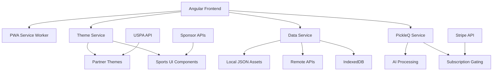
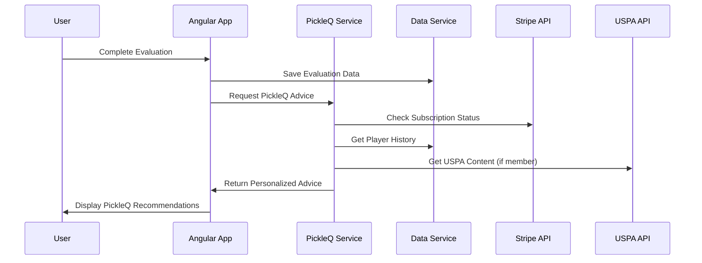

# PickleQ Comprehensive Upgrade Plan

## Transforming PickleIQ into a Partnership-Ready Platform with AI Assistant Coaching

**Document Version**: 1.0
**Created**: September 2025
**Last Updated**: September 2025
**Project Duration**: 22 Weeks
**Target Launch**: Q2 2026

---

## Executive Summary

This document outlines the comprehensive transformation of PickleIQ from a basic skill evaluation tool into a partnership-ready, AI-enhanced pickleball coaching platform. The upgrade introduces PickleQ AI Assistant, sports-themed design system, partnership integrations with USPA and equipment manufacturers, and robust offline/online data capabilities.

### Key Transformation Goals

- **Revenue Growth**: Target $900k ARR within 18 months through subscriptions and partnerships
- **User Experience**: Sports-themed, mobile-first design with international accessibility
- **AI Coaching**: PickleQ assistant for personalized coaching advice and recommendations
- **Partnership Ready**: USPA integration and manufacturer sponsorship capabilities
- **Data Independence**: Hybrid online/offline system with JSON asset storage

### Success Metrics

- **User Adoption**: 50k+ active users within 12 months
- **Subscription Conversion**: 20%+ free-to-paid conversion rate
- **Partnership Revenue**: $600k ARR from USPA and sponsor partnerships
- **PickleQ Engagement**: 80%+ weekly usage among subscribers
- **Mobile Performance**: <2s load times on 3G networks

---

## Phase 1: Sports Theme Foundation & Partnership Infrastructure

**Duration**: Weeks 1-3
**Goal**: Establish sports-themed design system with partnership-ready architecture

### 1.1 Global Sports Theme Architecture ✅ COMPLETED

- ✅ **COMPLETED**: Setup global SCSS theme architecture with CSS custom properties
- ✅ **COMPLETED**: Create sports color palette (pickleball court green #228B22, ball yellow #FFD700, net white #F8F8FF)
- ✅ **COMPLETED**: Implement CSS custom properties for dynamic partner branding
- ✅ **COMPLETED**: Create theme service for partner management and revenue tracking

### 1.2 Sports UI Component System

- **Sports Typography**: Montserrat display font, Open Sans body text for athletic feel
- **Component Library**: Paddle-shaped buttons, court-inspired cards, trophy effects
- **Animation System**: Bouncing ball loaders, trophy shine effects, court line patterns
- **Rating System**: Paddle icons instead of traditional stars
- **Color System**: Sport-specific color variables for consistent theming

### 1.3 White-Label Partnership System

- **Partner Logo Integration**: Header, footer, and splash screen logo spaces
- **USPA Theme Variant**: Navy blue (#003366) and gold (#FFD700) co-branding
- **Sponsor Integration**: Advertisement banners and product placement areas
- **Revenue Tracking**: Partner usage analytics and automated revenue sharing
- **Theme Customization**: CSS custom properties for partner-specific branding

### 1.4 Partnership Business Infrastructure

- **Revenue Sharing System**: Automated 70/30 split calculation for USPA partnership
- **Usage Analytics**: Partner-specific engagement and conversion tracking
- **Billing Integration**: Partner-specific payment processing and reporting
- **Dashboard Creation**: Partner metrics and revenue visualization
- **API Foundation**: RESTful endpoints for partner data integration

### Deliverables

- [ ] Sports-themed SCSS architecture with CSS custom properties
- [ ] Partner theme service with dynamic branding capabilities
- [ ] Sports UI component library documentation
- [ ] USPA co-branded theme implementation
- [ ] Partnership revenue tracking infrastructure

---

## Phase 2: Data Migration to JSON Assets with Hybrid System

**Duration**: Weeks 4-6
**Goal**: Migrate from Google Sheets to local JSON files with seamless online/offline switching

### 2.1 Data Migration & Asset Storage

- **Skills Data Migration**: Extract Google Sheets skills data to `assets/data/skills.json`
- **Grades Data Migration**: Extract grading criteria to `assets/data/grades.json`
- **Instructions Migration**: Move evaluation instructions to `assets/data/evaluation-instructions.json`
- **Partner Data**: Create partner-specific data files (`assets/data/partners/uspa-skills.json`)
- **Training Videos**: Curated video metadata in `assets/data/training-videos.json`

### 2.2 Hybrid Data Source Architecture

```typescript
interface IDataSourceService {
  getSkills(level?: string): Observable<Skill[]>;
  getGrades(): Observable<Grade[]>;
  getEvaluationInstructions(level: string): Observable<string>;
  getTrainingVideos(skillCode?: string): Observable<TrainingVideo[]>;
}

// Implementations:
// - LocalDataService: Serves from JSON files in assets
// - RemoteDataService: Google Sheets/YouTube API calls
// - HybridDataService: Automatic fallback (remote → local → cached)
```

### 2.3 Data Source Management

- **Configuration Toggle**: Environment setting for data source preference
- **Automatic Failover**: Seamless switching when remote services unavailable
- **Sync Status**: User-facing indicators for current data source
- **Manual Controls**: Admin panel for data source switching and refresh
- **Health Monitoring**: Data source availability and performance tracking

### 2.4 Enhanced Local Storage with IndexedDB

```typescript
// IndexedDB Schema using Dexie.js
class PickleIQDatabase extends Dexie {
  evaluations!: Table<Evaluation>;
  users!: Table<User>;
  coachingSessions!: Table<CoachingSession>;
  pickleqAdvice!: Table<PickleQAdvice>;
  partnerData!: Table<PartnerData>;
}
```

### 2.5 Asset Directory Structure

```
src/assets/data/
├── skills.json                    # Core skill definitions
├── grades.json                    # A/B/C/D grading criteria
├── evaluation-instructions.json   # Level-specific instructions
├── training-videos.json           # Curated video metadata
├── pickleq-advice/                # AI coaching templates
│   ├── technique-advice.json
│   ├── strategy-advice.json
│   ├── mental-game-advice.json
│   └── equipment-advice.json
├── partners/                      # Partner customizations
│   ├── uspa-skills.json          # USPA skill variations
│   ├── uspa-content.json         # USPA exclusive content
│   └── uspa-certifications.json  # Coaching certifications
└── sponsors/                      # Sponsor content
    ├── paddle-catalog.json       # Equipment recommendations
    └── manufacturer-content.json  # Product placement data
```

### Deliverables

- [ ] Complete data migration from Google Sheets to JSON assets
- [ ] Hybrid data service implementation with automatic failover
- [ ] IndexedDB integration for user-generated data
- [ ] Data source management UI and admin controls
- [ ] Offline sync queue and conflict resolution

---

## Phase 3: PickleQ AI Assistant Infrastructure

**Duration**: Weeks 7-9
**Goal**: Implement "Ask PickleQ" AI coaching assistant with subscription model

### 3.1 PickleQ AI Assistant Core System

- **"Ask PickleQ" Integration**: Button placement throughout evaluation flow
- **Question Processing**: Natural language understanding for coaching questions
- **Advice Generation**: Contextual coaching recommendations based on evaluation data
- **Response Categories**: Technique, strategy, training, mental game, equipment
- **Progress Tracking**: Historical advice and improvement correlation

### 3.2 PickleQ Subscription Model

| Tier                | Price        | Features                                      | Target Users         |
| ------------------- | ------------ | --------------------------------------------- | -------------------- |
| **Free**            | $0           | Manual evaluations, partner branding          | Casual players       |
| **PickleQ Starter** | $14.99/month | 25 PickleQ questions/month, basic AI coaching | Regular players      |
| **PickleQ Pro**     | $24.99/month | Unlimited PickleQ, advanced coaching          | Serious players      |
| **PickleQ Coach**   | $49.99/month | Pro + coach tools + revenue sharing           | Professional coaches |

### 3.3 PickleQ AI Processing Pipeline

```typescript
interface PickleQRequest {
  playerId: string;
  question: string;
  context: {
    recentEvaluations: Evaluation[];
    skillLevel: number;
    weakAreas: string[];
    preferences: PlayerPreferences;
  };
}

interface PickleQResponse {
  advice: string;
  category: 'technique' | 'strategy' | 'mental' | 'training' | 'equipment';
  confidence: number;
  trainingVideos: TrainingVideo[];
  drillRecommendations: Drill[];
  followUpQuestions: string[];
  sponsorRecommendations?: ProductRecommendation[];
}
```

### 3.4 PickleQ Integration Points

- **Evaluation Results**: Contextual PickleQ suggestions based on scores
- **Training Videos**: PickleQ-curated video recommendations
- **Progress Tracking**: PickleQ analysis of improvement patterns
- **Skill Development**: PickleQ-generated learning pathways
- **Equipment Advice**: Sponsor product recommendations via PickleQ

### 3.5 PickleQ Partner Integration

- **USPA Content**: Approved coaching methodologies and certification paths
- **Sponsor Products**: Equipment recommendations integrated in advice
- **Regional Coaching**: Culturally appropriate coaching styles per language
- **Certification Tracking**: USPA coaching credentials and continuing education
- **Revenue Attribution**: Partner conversion tracking from PickleQ recommendations

### Deliverables

- [ ] PickleQ AI assistant infrastructure and API design
- [ ] Subscription tier implementation with feature gating
- [ ] PickleQ advice generation and personalization system
- [ ] Partner-specific PickleQ content integration
- [ ] Usage tracking and subscription analytics

---

## Phase 4: Internationalization with Partner Localization

**Duration**: Weeks 10-11
**Goal**: Multi-language support with partner-specific translations

### 4.1 Angular i18n Implementation

- **Language Support**: English, Spanish, French, German, Portuguese
- **Translation Architecture**: Hierarchical key structure with partner overrides
- **Build Pipeline**: Language-specific bundles with partner customizations
- **Dynamic Switching**: Runtime language changes without page reload
- **Preference Persistence**: User language settings with partner context

### 4.2 PickleQ Localization

- **Coaching Terminology**: Sport-specific terms per language and region
- **Cultural Adaptation**: Coaching styles appropriate for different cultures
- **Partner Translations**: USPA-specific terminology and content
- **Response Localization**: PickleQ personality and communication style per language
- **Regional Expertise**: Local coaching methodologies and tournament standards

### 4.3 Data Asset Localization

```
src/assets/data/i18n/
├── en/
│   ├── skills.json
│   ├── evaluation-instructions.json
│   └── pickleq-advice/
├── es/
│   ├── skills.json
│   ├── evaluation-instructions.json
│   └── pickleq-advice/
└── partners/
    ├── uspa/
    │   ├── en/
    │   └── es/
    └── sponsors/
        ├── en/
        └── es/
```

### 4.4 Partner-Specific Localization

- **USPA Terminology**: Official coaching terms and certification language
- **Sponsor Content**: Product descriptions and marketing copy per language
- **Regional Compliance**: Local regulations and legal requirements
- **Cultural Sensitivity**: Appropriate coaching approaches per culture
- **Certification Standards**: International coaching credential recognition

### Deliverables

- [ ] Angular i18n implementation with 5 language support
- [ ] Localized data assets and partner-specific translations
- [ ] PickleQ AI assistant localization with cultural adaptation
- [ ] Partner content translation workflows
- [ ] Regional compliance and certification integration

---

## Phase 5: Enhanced Evaluation System with PickleQ Integration

**Duration**: Weeks 12-14
**Goal**: Upgrade evaluation system with PickleQ AI coaching integration

### 5.1 Sports-Themed Evaluation Interface

- **Court-Inspired Design**: Evaluation forms styled like pickleball scorecards
- **Paddle Rating System**: Replace star ratings with paddle icons
- **Progress Visualization**: Trophy milestones and achievement animations
- **Mobile Optimization**: Touch-friendly controls and gesture navigation
- **Partner Branding**: Seamless integration of partner logos and colors

### 5.2 PickleQ-Enhanced Evaluation Flow

```typescript
interface EnhancedEvaluation {
  // Standard evaluation data
  playerId: string;
  coachId?: string;
  skillLevel: number;
  scores: { [skillCode: string]: 'A' | 'B' | 'C' | 'D' };

  // PickleQ integration
  pickleqSuggestions: PickleQSuggestion[];
  improvementPlan: ImprovementPlan;
  trainingRecommendations: TrainingRecommendation[];
  nextSteps: string[];
}
```

### 5.3 Contextual PickleQ Integration

- **Smart Suggestions**: PickleQ recommendations based on evaluation patterns
- **Weakness Analysis**: AI identification of skill gaps and improvement areas
- **Progress Correlation**: PickleQ tracking of advice effectiveness over time
- **Benchmark Comparison**: Performance analysis against skill level standards
- **Tournament Readiness**: PickleQ assessment of competitive preparedness

### 5.4 Mobile-First Evaluation Experience

- **Responsive Design**: Optimal experience across all device sizes
- **Touch Interactions**: Gesture-based navigation and form completion
- **Offline Capability**: Complete evaluations without internet connection
- **Voice Input**: Speech-to-text for notes and feedback
- **Camera Integration**: Photo capture for evaluation documentation

### 5.5 Partner-Enhanced Features

- **USPA Certification**: Display of coaching credentials and verification
- **Member Benefits**: Exclusive content and discounts for USPA members
- **Sponsor Integration**: Equipment recommendations in evaluation context
- **Regional Standards**: Tournament and coaching standards per geographic area
- **Revenue Tracking**: Partner attribution for subscription conversions

### Deliverables

- [ ] Sports-themed evaluation interface with mobile optimization
- [ ] PickleQ integration throughout evaluation workflow
- [ ] Contextual AI recommendations and improvement planning
- [ ] Partner-specific features and member benefits
- [ ] Voice input and camera integration for mobile users

---

## Phase 6: Payment Gateway & Subscription Management

**Duration**: Weeks 15-16
**Goal**: Implement comprehensive payment system for PickleQ subscriptions

### 6.1 Payment Processing Infrastructure

- **Stripe Integration**: Primary payment processor with international support
- **Mobile Payments**: Apple Pay and Google Pay for frictionless mobile checkout
- **Security Compliance**: PCI DSS Level 1 compliance and tokenization
- **Multiple Currencies**: Support for international partnerships and users
- **Fraud Protection**: Advanced fraud detection and risk management

### 6.2 Subscription Management System

```typescript
interface SubscriptionTier {
  id: string;
  name: string;
  price: number;
  currency: string;
  features: string[];
  pickleqQuestions: number; // -1 for unlimited
  partnerBenefits: PartnerBenefit[];
  trialPeriod: number; // days
}

interface SubscriptionManager {
  createSubscription(userId: string, tierId: string): Promise<Subscription>;
  upgradeSubscription(subscriptionId: string, newTierId: string): Promise<void>;
  cancelSubscription(subscriptionId: string, reason?: string): Promise<void>;
  trackUsage(userId: string, feature: string, metadata?: any): Promise<void>;
}
```

### 6.3 Partnership Revenue Sharing

- **USPA Revenue Split**: Automated 70% PickleIQ / 30% USPA distribution
- **Sponsor Attribution**: Revenue tracking for partner-driven conversions
- **Member Discounts**: USPA member 25% discount implementation
- **Usage Analytics**: Partner-specific subscription and engagement metrics
- **Automated Payouts**: Monthly revenue sharing calculations and distributions

### 6.4 Subscription Analytics & Optimization

- **Conversion Tracking**: Free-to-paid conversion optimization
- **Churn Prediction**: ML-based subscriber retention analysis
- **A/B Testing**: Pricing and feature optimization experiments
- **Lifecycle Management**: Automated onboarding and retention campaigns
- **Partner Performance**: ROI analysis for partnership investments

### 6.5 Mobile Payment Experience

- **One-Click Checkout**: Streamlined subscription signup process
- **Biometric Authentication**: Touch ID and Face ID support for purchases
- **Offline Billing**: Cached subscription status and feature access
- **Push Notifications**: Payment confirmations and subscription updates
- **Customer Support**: In-app billing support and self-service portal

### Deliverables

- [ ] Stripe payment gateway integration with international support
- [ ] Subscription tier management and feature gating system
- [ ] Partnership revenue sharing automation and reporting
- [ ] Mobile-optimized payment experience with biometric auth
- [ ] Subscription analytics dashboard and optimization tools

---

## Phase 7: Video Integration with PickleQ Recommendations

**Duration**: Weeks 17-18
**Goal**: Enhanced video system with PickleQ training recommendations

### 7.1 PickleQ Video Recommendation Engine

```typescript
interface VideoRecommendationEngine {
  // Generate recommendations based on evaluation weaknesses
  getRecommendationsForEvaluation(evaluationId: string): Promise<VideoRecommendation[]>;

  // Skill-specific video curation
  getSkillVideos(skillCode: string, playerLevel: number): Promise<TrainingVideo[]>;

  // PickleQ-curated learning sequences
  generateLearningPath(weakAreas: string[], targetLevel: number): Promise<LearningPath>;

  // Sponsor product integration
  getEquipmentVideos(productCategory: string): Promise<ProductVideo[]>;
}
```

### 7.2 Sports-Themed Video Interface

- **Court-Inspired Player**: Video controls styled like pickleball equipment
- **Annotation System**: PickleQ commentary overlays on training videos
- **Progress Tracking**: Video completion and skill improvement correlation
- **Mobile Optimization**: Touch controls and landscape mode optimization
- **Offline Downloads**: Key training videos available offline

### 7.3 PickleQ Video Analysis Integration

- **Technique Commentary**: PickleQ analysis of video demonstrations
- **Drill Recommendations**: PickleQ-suggested practice routines
- **Equipment Integration**: Sponsor product placement in relevant videos
- **Progress Comparison**: Before/after video analysis capabilities
- **Sharing Features**: Social sharing with partner branding

### 7.4 Partner Video Content

- **USPA Training Library**: Official USPA-approved instructional content
- **Sponsor Demonstrations**: Product showcase videos with purchase integration
- **Tournament Coverage**: USPA event highlights and technique analysis
- **Coaching Certifications**: Video-based continuing education content
- **Regional Content**: Location-specific coaching and tournament preparation

### 7.5 Video Analytics & Optimization

- **Engagement Tracking**: Video completion rates and user interactions
- **Recommendation Effectiveness**: Correlation between videos and skill improvement
- **Sponsor Performance**: Click-through rates and conversion tracking
- **Content Curation**: AI-powered video quality assessment and ranking
- **Partner Analytics**: Video performance metrics for USPA and sponsors

### Deliverables

- [ ] PickleQ video recommendation engine with skill-based curation
- [ ] Sports-themed video interface with mobile optimization
- [ ] Partner video content integration and analytics
- [ ] Video analysis tools with PickleQ commentary
- [ ] Offline video capabilities and progress tracking

---

## Phase 8: Mobile Optimization & PWA Features

**Duration**: Weeks 19-20
**Goal**: Complete mobile-first experience with offline PickleQ capabilities

### 8.1 Progressive Web App Implementation

- **Service Worker**: Offline-first architecture with background sync
- **App Installation**: Home screen installation with sports-themed icons
- **Push Notifications**: PickleQ coaching reminders and subscription updates
- **Background Sync**: Offline data sync when connection restored
- **Performance Optimization**: Code splitting and lazy loading

### 8.2 Mobile Sports Theme Optimization

- **Touch Interactions**: Gesture-based navigation and sports-themed animations
- **Responsive Layouts**: Partner branding adaptation across screen sizes
- **Performance**: <2s load times on 3G networks with sports animations
- **Battery Optimization**: Efficient animation rendering and CPU usage
- **Accessibility**: Touch target sizes and screen reader compatibility

### 8.3 Offline PickleQ Capabilities

```typescript
interface OfflinePickleQService {
  // Cache popular coaching advice for offline access
  cacheCoachingAdvice(userId: string): Promise<void>;

  // Offline evaluation completion with PickleQ integration
  completeOfflineEvaluation(evaluation: Evaluation): Promise<OfflineEvaluation>;

  // Sync offline activities when connection restored
  syncOfflineData(): Promise<SyncResult>;

  // Offline training video downloads
  downloadTrainingVideos(recommendations: VideoRecommendation[]): Promise<void>;
}
```

### 8.4 Mobile Performance Optimization

- **Code Splitting**: Dynamic imports for feature-based loading
- **Image Optimization**: WebP format with fallbacks and lazy loading
- **Animation Performance**: GPU acceleration for sports-themed effects
- **Bundle Size**: <2MB initial bundle with aggressive tree shaking
- **Network Efficiency**: GraphQL queries and response caching

### 8.5 Cross-Platform Compatibility

- **iOS Safari**: Native app behavior with proper viewport handling
- **Android Chrome**: PWA installation and notification support
- **Responsive Design**: Consistent experience across tablet and phone
- **Partner Branding**: Mobile-optimized logo placement and navigation
- **Accessibility**: WCAG 2.1 AA compliance on all mobile devices

### Deliverables

- [ ] PWA implementation with offline-first architecture
- [ ] Mobile sports theme optimization with touch interactions
- [ ] Offline PickleQ capabilities and sync functionality
- [ ] Cross-platform mobile compatibility and performance
- [ ] Mobile accessibility compliance and optimization

---

## Phase 9: Testing & Production Deployment

**Duration**: Weeks 21-22
**Goal**: Comprehensive testing and partnership-ready deployment

### 9.1 Testing Strategy

```typescript
// Test Coverage Requirements
interface TestingSuite {
  unitTests: {
    coverage: '>90%';
    focus: ['PickleQ AI', 'Payment Gateway', 'Theme Service', 'Data Migration'];
  };
  integrationTests: {
    coverage: '>85%';
    focus: ['Partner APIs', 'Subscription Flow', 'Offline Sync', 'Video System'];
  };
  e2eTests: {
    scenarios: ['User Registration → Evaluation → PickleQ → Subscription'];
    devices: ['Mobile', 'Tablet', 'Desktop'];
    browsers: ['Chrome', 'Safari', 'Firefox', 'Edge'];
  };
  performanceTests: {
    loadTime: '<2s on 3G';
    responsiveness: '<100ms touch response';
    accessibility: 'WCAG 2.1 AA compliance';
  };
}
```

### 9.2 Partnership Integration Testing

- **USPA Authentication**: Member verification and benefit validation
- **Revenue Sharing**: Automated calculation and distribution accuracy
- **Sponsor Content**: Product placement and conversion tracking
- **Theme Customization**: Partner branding consistency across devices
- **Analytics Integration**: Data accuracy and real-time reporting

### 9.3 PickleQ AI Assistant Testing

- **Advice Quality**: Relevance and accuracy of coaching recommendations
- **Subscription Gating**: Feature access control and usage tracking
- **Multilingual Support**: Translation quality and cultural appropriateness
- **Response Time**: <3s response time for PickleQ queries
- **Offline Functionality**: Cached advice accessibility and sync

### 9.4 Data Migration Validation

- **Data Integrity**: 100% accuracy from Google Sheets to JSON assets
- **Fallback Testing**: Seamless switching between data sources
- **Performance**: 50% improvement in load times with local assets
- **Offline Access**: Complete functionality without internet
- **Sync Reliability**: Conflict resolution and data consistency

### 9.5 Production Deployment Strategy

```yaml
# Deployment Pipeline
production_deployment:
  infrastructure:
    - CDN: CloudFlare for global asset delivery
    - Hosting: Vercel for Angular application
    - Database: Firebase for user data and analytics
    - Payments: Stripe for subscription processing
    - Monitoring: Sentry for error tracking and performance

  partner_configurations:
    - USPA: Member authentication and revenue sharing
    - Sponsors: Product catalog integration and analytics
    - Theme: Dynamic branding and customization

  rollout_strategy:
    - Blue/Green deployment with zero downtime
    - Feature flags for gradual PickleQ rollout
    - Partner-specific configurations and testing
    - Performance monitoring and rollback procedures
```

### 9.6 Launch Preparation

- **Documentation**: User guides, API documentation, partner onboarding
- **Support System**: Customer service workflows and escalation procedures
- **Marketing Materials**: Partner co-branded promotional content
- **Training**: USPA coach training and certification integration
- **Monitoring**: Real-time analytics and performance dashboards

### Deliverables

- [ ] Comprehensive testing suite with >90% coverage
- [ ] Partnership integration validation and testing
- [ ] Production deployment infrastructure and monitoring
- [ ] Launch preparation and support system implementation
- [ ] Documentation and training materials for all stakeholders

---

## Technical Architecture Overview

### System Architecture



### Data Flow Architecture



### Partnership Integration Architecture

```typescript
interface PartnershipAPI {
  // USPA Integration
  uspa: {
    authenticateMember(credentials: USPACredentials): Promise<Member>;
    validateCertification(coachId: string): Promise<Certification>;
    getApprovedContent(contentType: string): Promise<Content[]>;
    trackRevenue(subscription: Subscription): Promise<void>;
  };

  // Sponsor Integration
  sponsors: {
    getProductCatalog(category: string): Promise<Product[]>;
    trackConversion(userId: string, productId: string): Promise<void>;
    getAdvertisementContent(placement: string): Promise<Ad[]>;
    reportAnalytics(metrics: SponsorMetrics): Promise<void>;
  };
}
```

---

## Revenue Model & Financial Projections

### Subscription Revenue Projections

| Year   | Users   | Conversion Rate | ARPU | Subscription Revenue |
| ------ | ------- | --------------- | ---- | -------------------- |
| Year 1 | 50,000  | 20%             | $240 | $2,400,000           |
| Year 2 | 100,000 | 25%             | $280 | $7,000,000           |
| Year 3 | 200,000 | 30%             | $320 | $19,200,000          |

### Partnership Revenue Projections

| Partner Type          | Year 1       | Year 2         | Year 3         |
| --------------------- | ------------ | -------------- | -------------- |
| USPA Revenue Share    | $200,000     | $500,000       | $1,200,000     |
| Tier 1 Sponsors (4×)  | $200,000     | $400,000       | $800,000       |
| Tier 2 Sponsors (6×)  | $150,000     | $300,000       | $600,000       |
| Tier 3 Sponsors (8×)  | $80,000      | $160,000       | $320,000       |
| **Total Partnership** | **$630,000** | **$1,360,000** | **$2,920,000** |

### Cost Structure Analysis

| Category              | Year 1         | Year 2         | Year 3         |
| --------------------- | -------------- | -------------- | -------------- |
| Development Team      | $800,000       | $1,200,000     | $1,800,000     |
| Infrastructure        | $120,000       | $300,000       | $600,000       |
| Partner Revenue Share | $189,000       | $408,000       | $876,000       |
| Marketing & Sales     | $400,000       | $800,000       | $1,500,000     |
| Operations            | $200,000       | $400,000       | $800,000       |
| **Total Costs**       | **$1,709,000** | **$3,108,000** | **$5,576,000** |

### Profitability Timeline

- **Year 1**: Revenue $3,030,000 - Costs $1,709,000 = **Profit $1,321,000**
- **Year 2**: Revenue $8,360,000 - Costs $3,108,000 = **Profit $5,252,000**
- **Year 3**: Revenue $22,120,000 - Costs $5,576,000 = **Profit $16,544,000**

---

## Risk Assessment & Mitigation

### Technical Risks

| Risk                      | Probability | Impact | Mitigation Strategy                                              |
| ------------------------- | ----------- | ------ | ---------------------------------------------------------------- |
| Data Migration Failure    | Medium      | High   | Comprehensive testing, rollback procedures, hybrid data access   |
| PickleQ AI Performance    | Medium      | High   | Human coaching fallback, performance monitoring, gradual rollout |
| Mobile Performance Issues | Low         | Medium | Progressive loading, performance budgets, device testing         |
| Security Vulnerabilities  | Low         | High   | Security audits, PCI compliance, regular updates                 |

### Business Risks

| Risk                     | Probability | Impact | Mitigation Strategy                                                |
| ------------------------ | ----------- | ------ | ------------------------------------------------------------------ |
| USPA Partnership Failure | Low         | High   | Legal agreements, revenue guarantees, alternative partnerships     |
| Sponsor Churn            | Medium      | Medium | Performance analytics, ROI demonstration, contract incentives      |
| Competition              | High        | Medium | Feature differentiation, partnership exclusivity, rapid innovation |
| Market Adoption          | Medium      | High   | User research, beta testing, marketing investment                  |

### Partnership Risks

| Risk                     | Probability | Impact | Mitigation Strategy                                           |
| ------------------------ | ----------- | ------ | ------------------------------------------------------------- |
| USPA Member Adoption     | Medium      | High   | Member benefits, exclusive content, training programs         |
| Revenue Sharing Disputes | Low         | Medium | Clear contracts, automated tracking, regular audits           |
| Brand Conflict           | Low         | High   | Brand guidelines, approval processes, conflict resolution     |
| Technical Integration    | Medium      | Medium | API standardization, testing protocols, support documentation |

---

## Success Metrics & KPIs

### User Engagement Metrics

- **Daily Active Users**: Target 10% of total users
- **Weekly PickleQ Usage**: >80% of subscribers
- **Evaluation Completion Rate**: >85% start-to-finish
- **Mobile Usage**: >70% of total sessions
- **Session Duration**: Average 15+ minutes

### Revenue Metrics

- **Monthly Recurring Revenue (MRR)**: $250k by month 12
- **Customer Acquisition Cost (CAC)**: <$50 per user
- **Lifetime Value (LTV)**: >$400 per user
- **Conversion Rate**: 20%+ free to paid
- **Churn Rate**: <5% monthly

### Partnership Metrics

- **USPA Member Adoption**: 25% of members using PickleIQ
- **Sponsor ROI**: >300% return on investment
- **Partner Revenue Growth**: 50%+ year-over-year
- **Brand Satisfaction**: >85% partner approval rating
- **Integration Usage**: >90% partner feature utilization

### Technical Metrics

- **Page Load Speed**: <2s on 3G networks
- **Uptime**: >99.9% availability
- **Error Rate**: <0.1% of requests
- **Mobile Performance**: >90% Lighthouse score
- **Security**: Zero data breaches

---

## Implementation Timeline

### Critical Path Analysis

The following dependencies define the critical path for successful delivery:

1. **Weeks 1-3**: Sports theme foundation → Partnership infrastructure
2. **Weeks 4-6**: Data migration → Hybrid data system
3. **Weeks 7-9**: PickleQ AI infrastructure → Subscription system
4. **Weeks 10-11**: Internationalization → Partner localization
5. **Weeks 12-14**: Enhanced evaluations → PickleQ integration
6. **Weeks 15-16**: Payment gateway → Revenue sharing
7. **Weeks 17-18**: Video integration → PickleQ recommendations
8. **Weeks 19-20**: Mobile optimization → PWA features
9. **Weeks 21-22**: Testing → Production deployment

### Resource Allocation

- **Frontend Developers**: 3 full-time (Angular, TypeScript, SCSS)
- **Backend Developers**: 2 full-time (Node.js, APIs, databases)
- **UI/UX Designer**: 1 full-time (sports theme, mobile design)
- **DevOps Engineer**: 1 part-time (infrastructure, deployment)
- **QA Engineer**: 1 full-time (testing, automation)
- **Product Manager**: 1 full-time (coordination, requirements)
- **Partnership Manager**: 1 part-time (USPA, sponsor relations)

### Milestone Delivery Schedule

- **Week 3**: Sports theme demo with USPA branding
- **Week 6**: Data migration complete with local/remote switching
- **Week 9**: PickleQ AI assistant beta with subscription gating
- **Week 11**: Multi-language support with partner localization
- **Week 14**: Enhanced evaluations with PickleQ integration
- **Week 16**: Payment system with USPA revenue sharing
- **Week 18**: Video recommendations with sponsor integration
- **Week 20**: Mobile PWA with offline capabilities
- **Week 22**: Production launch with full partner integration

---

## Conclusion

This comprehensive upgrade plan transforms PickleIQ from a basic evaluation tool into a sophisticated, partnership-ready platform that serves players, coaches, and industry partners. The introduction of PickleQ AI assistant, sports-themed design, and robust partnership capabilities positions PickleIQ as the premier platform in the pickleball coaching space.

### Key Success Factors

1. **User-Centric Design**: Sports-themed, mobile-first experience with accessibility
2. **Partnership Value**: Clear ROI for USPA and sponsor partners
3. **AI Integration**: PickleQ assistant that genuinely improves player outcomes
4. **Technical Excellence**: Reliable, fast, offline-capable platform
5. **Revenue Diversification**: Multiple income streams reducing business risk

### Next Steps

1. **Stakeholder Approval**: Present plan to leadership and partner organizations
2. **Team Assembly**: Recruit and onboard development team
3. **Partnership Agreements**: Finalize legal agreements with USPA and initial sponsors
4. **Development Kickoff**: Begin Phase 1 implementation
5. **Beta Testing**: Recruit pilot users for early feedback and validation

The successful execution of this plan will establish PickleIQ as the industry leader in pickleball coaching technology, creating sustainable competitive advantages through partnership integration and AI-powered coaching capabilities.

---

**Document Prepared By**: PickleIQ Development Team
**Review Status**: Pending Stakeholder Approval
**Next Review Date**: Monthly throughout implementation
**Contact**: For questions or updates regarding this plan, contact the Product Manager

_This document serves as the authoritative guide for the PickleIQ transformation project and should be referenced for all implementation decisions and progress tracking._
