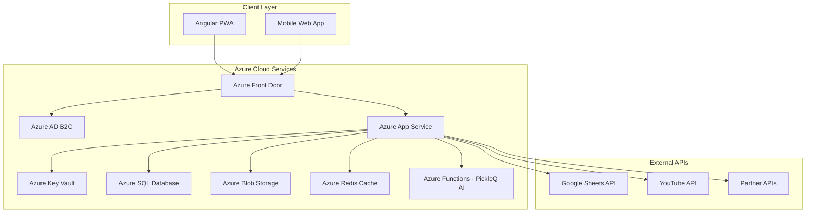

# PickleIQ Revised Technical Architecture

## Low-Risk Azure-First Approach

**Document Version**: 2.0
**Created**: September 2025
**Last Updated**: September 2025
**Architecture Type**: Simplified Monolithic Backend with Azure Cloud Services
**Risk Level**: LOW (Reduced from HIGH)

---

## Executive Summary

This revised architecture addresses critical security and complexity risks identified in the original design by:

- Moving from complex microservices to a simplified Azure App Service backend
- Securing API keys using Azure Key Vault and Managed Identity
- Implementing proper authentication with Azure AD B2C
- Removing dangerous client-side business logic
- Leveraging proven Azure cloud services

**Risk Reduction**: HIGH → LOW

---

## Table of Contents

1. [Simplified System Overview](#simplified-system-overview)
2. [Azure Security Foundation](#azure-security-foundation)
3. [Data Architecture Simplified](#data-architecture-simplified)
4. [Authentication & Authorization](#authentication--authorization)
5. [API Design - Server-Side First](#api-design---server-side-first)
6. [Deployment & Infrastructure](#deployment--infrastructure)
7. [Migration Plan](#migration-plan)

---

## Simplified System Overview

### High-Level Architecture



### Technology Stack - Simplified

| Layer              | Technology         | Purpose                 | Risk Level |
| ------------------ | ------------------ | ----------------------- | ---------- |
| **Frontend**       | Angular 20         | PWA Application         | LOW        |
| **Authentication** | Azure AD B2C       | Identity Management     | LOW        |
| **Backend API**    | Azure App Service  | Single API Service      | LOW        |
| **Database**       | Azure SQL Database | Relational Data         | LOW        |
| **Cache**          | Azure Redis Cache  | Performance Cache       | LOW        |
| **Storage**        | Azure Blob Storage | Static Assets & Files   | LOW        |
| **Secrets**        | Azure Key Vault    | API Keys & Secrets      | LOW        |
| **AI Service**     | Azure Functions    | PickleQ AI Processing   | LOW        |
| **CDN**            | Azure Front Door   | Global Content Delivery | LOW        |

---

## Azure Security Foundation

### Azure Key Vault Integration

```typescript
// Secure configuration service
@Injectable({ providedIn: 'root' })
export class SecureConfigService {
  private config: SecureConfig | null = null;

  constructor(private http: HttpClient) {}

  async loadConfig(): Promise<SecureConfig> {
    if (!this.config) {
      // Configuration loaded from server-side only
      this.config = await this.http.get<SecureConfig>('/api/config').toPromise();
    }
    return this.config;
  }

  // No more client-side API keys
  getEndpoint(service: string): string {
    return `/api/proxy/${service}`;
  }
}

// Server-side configuration (ASP.NET Core)
public class ConfigurationController : ControllerBase
{
    private readonly IKeyVaultService _keyVault;

    public ConfigurationController(IKeyVaultService keyVault)
    {
        _keyVault = keyVault;
    }

    [HttpGet("config")]
    public async Task<IActionResult> GetConfiguration()
    {
        // Only return safe configuration to client
        return Ok(new {
            apiEndpoint = "/api/v1",
            features = await GetEnabledFeatures(),
            // NO API KEYS sent to client
        });
    }

    [HttpGet("proxy/youtube")]
    public async Task<IActionResult> YouTubeProxy([FromQuery] string query)
    {
        var apiKey = await _keyVault.GetSecretAsync("youtube-api-key");
        // Server-side API call with secure key
        var result = await _youTubeService.SearchAsync(query, apiKey);
        return Ok(result);
    }
}
```

### Azure Managed Identity Configuration

```yaml
# Azure Resource Manager Template
resources:
  - type: Microsoft.Web/sites
    name: pickleiq-app-service
    properties:
      identity:
        type: SystemAssigned
      siteConfig:
        appSettings:
          - name: KeyVaultName
            value: pickleiq-keyvault
          - name: ASPNETCORE_ENVIRONMENT
            value: Production

  - type: Microsoft.KeyVault/vaults
    name: pickleiq-keyvault
    properties:
      accessPolicies:
        - objectId: "[reference(resourceId('Microsoft.Web/sites', 'pickleiq-app-service'), '2019-08-01', 'Full').identity.principalId]"
          permissions:
            secrets: ['get']
```

---

## Data Architecture Simplified

### Server-Side Data Management

```csharp
// Secure data service - server-side only
public class SkillDataService
{
    private readonly IConfiguration _config;
    private readonly HttpClient _httpClient;
    private readonly IMemoryCache _cache;
    private readonly IKeyVaultService _keyVault;

    public async Task<List<Skill>> GetSkillsAsync(string level = null)
    {
        var cacheKey = $"skills_{level ?? "all"}";

        if (_cache.TryGetValue(cacheKey, out List<Skill> cached))
        {
            return cached;
        }

        // Secure API call with Key Vault
        var apiKey = await _keyVault.GetSecretAsync("google-sheets-api-key");
        var spreadsheetId = await _keyVault.GetSecretAsync("google-sheets-id");

        var skills = await FetchFromGoogleSheets(apiKey, spreadsheetId, level);

        // Cache for 1 hour
        _cache.Set(cacheKey, skills, TimeSpan.FromHours(1));

        return skills;
    }

    private async Task<List<Skill>> FetchFromGoogleSheets(string apiKey, string spreadsheetId, string level)
    {
        // Secure server-side Google Sheets integration
        var url = $"https://sheets.googleapis.com/v4/spreadsheets/{spreadsheetId}/values/Skills?key={apiKey}";

        var response = await _httpClient.GetAsync(url);
        response.EnsureSuccessStatusCode();

        var data = await response.Content.ReadAsStringAsync();
        var skills = ParseSkillsData(data);

        return level != null
            ? skills.Where(s => s.Level == level).ToList()
            : skills;
    }
}
```

### Simplified Database Schema

```sql
-- Azure SQL Database Schema
CREATE TABLE Users (
    Id UNIQUEIDENTIFIER PRIMARY KEY DEFAULT NEWID(),
    AzureAdB2CId NVARCHAR(255) NOT NULL UNIQUE,
    Email NVARCHAR(255) NOT NULL,
    Name NVARCHAR(255) NOT NULL,
    CreatedAt DATETIME2 NOT NULL DEFAULT GETUTCDATE(),
    IsActive BIT NOT NULL DEFAULT 1
);

CREATE TABLE Evaluations (
    Id UNIQUEIDENTIFIER PRIMARY KEY DEFAULT NEWID(),
    UserId UNIQUEIDENTIFIER NOT NULL REFERENCES Users(Id),
    SkillLevel NVARCHAR(10) NOT NULL,
    EvaluationData NVARCHAR(MAX) NOT NULL, -- JSON data
    CreatedAt DATETIME2 NOT NULL DEFAULT GETUTCDATE(),
    UpdatedAt DATETIME2 NOT NULL DEFAULT GETUTCDATE()
);

CREATE TABLE PickleQSessions (
    Id UNIQUEIDENTIFIER PRIMARY KEY DEFAULT NEWID(),
    UserId UNIQUEIDENTIFIER NOT NULL REFERENCES Users(Id),
    Question NVARCHAR(MAX) NOT NULL,
    Response NVARCHAR(MAX) NOT NULL,
    Category NVARCHAR(100),
    CreatedAt DATETIME2 NOT NULL DEFAULT GETUTCDATE()
);

-- Indexes for performance
CREATE INDEX IX_Evaluations_UserId ON Evaluations(UserId);
CREATE INDEX IX_PickleQSessions_UserId ON PickleQSessions(UserId);
CREATE INDEX IX_PickleQSessions_CreatedAt ON PickleQSessions(CreatedAt);
```

---

## Authentication & Authorization

### Azure AD B2C Configuration

```typescript
// Simplified Angular authentication
@Injectable({ providedIn: 'root' })
export class AuthService {
  private authConfig: AuthConfig = {
    issuer: 'https://pickleiq.b2clogin.com/pickleiq.onmicrosoft.com/B2C_1_signup_signin/v2.0',
    clientId: 'your-client-id', // Configured in Azure
    responseType: 'code',
    scope: 'openid profile email',
    redirectUri: window.location.origin + '/auth-callback',
    postLogoutRedirectUri: window.location.origin,
    silentRefreshRedirectUri: window.location.origin + '/silent-refresh.html',
  };

  constructor(private oauthService: OAuthService) {
    this.configureAuth();
  }

  private configureAuth(): void {
    this.oauthService.configure(this.authConfig);
    this.oauthService.loadDiscoveryDocumentAndTryLogin();
  }

  login(): void {
    this.oauthService.initCodeFlow();
  }

  logout(): void {
    this.oauthService.logOut();
  }

  get isAuthenticated(): boolean {
    return this.oauthService.hasValidAccessToken();
  }

  get userProfile(): any {
    return this.oauthService.getIdentityClaims();
  }
}
```

### Server-Side Authorization

```csharp
[Authorize]
[ApiController]
[Route("api/v1/[controller]")]
public class EvaluationsController : ControllerBase
{
    private readonly IEvaluationService _evaluationService;

    [HttpGet]
    public async Task<IActionResult> GetEvaluations()
    {
        var userId = GetCurrentUserId();
        var evaluations = await _evaluationService.GetUserEvaluationsAsync(userId);
        return Ok(evaluations);
    }

    [HttpPost]
    public async Task<IActionResult> CreateEvaluation([FromBody] CreateEvaluationRequest request)
    {
        var userId = GetCurrentUserId();

        // Server-side validation
        if (!ModelState.IsValid)
            return BadRequest(ModelState);

        var evaluation = await _evaluationService.CreateEvaluationAsync(userId, request);
        return CreatedAtAction(nameof(GetEvaluation), new { id = evaluation.Id }, evaluation);
    }

    private Guid GetCurrentUserId()
    {
        var azureAdB2CId = User.FindFirst("sub")?.Value;
        return _userService.GetUserIdByAzureAdB2CId(azureAdB2CId);
    }
}
```

---

## API Design - Server-Side First

### Simplified API Structure

```csharp
// Clean API controllers with proper separation
[ApiController]
[Route("api/v1/[controller]")]
public class SkillsController : ControllerBase
{
    private readonly ISkillService _skillService;

    [HttpGet]
    [AllowAnonymous] // Public skill data
    public async Task<IActionResult> GetSkills([FromQuery] string level = null)
    {
        var skills = await _skillService.GetSkillsAsync(level);
        return Ok(skills);
    }
}

[Authorize]
[ApiController]
[Route("api/v1/[controller]")]
public class PickleQController : ControllerBase
{
    private readonly IPickleQService _pickleQService;
    private readonly ISubscriptionService _subscriptionService;

    [HttpPost("ask")]
    public async Task<IActionResult> AskQuestion([FromBody] PickleQRequest request)
    {
        var userId = GetCurrentUserId();

        // Server-side subscription validation
        var hasAccess = await _subscriptionService.ValidatePickleQAccessAsync(userId);
        if (!hasAccess)
            return Forbid("PickleQ requires an active subscription");

        var response = await _pickleQService.ProcessQuestionAsync(userId, request);
        return Ok(response);
    }
}
```

### Azure Functions for AI Processing

```csharp
// Serverless PickleQ processing
public static class PickleQFunction
{
    [FunctionName("ProcessPickleQQuestion")]
    public static async Task<IActionResult> Run(
        [HttpTrigger(AuthorizationLevel.Function, "post")] HttpRequest req,
        [CosmosDB(
            databaseName: "PickleIQ",
            collectionName: "PickleQSessions",
            ConnectionStringSetting = "CosmosDBConnection")] IAsyncCollector<object> documents,
        ILogger log)
    {
        var request = await JsonSerializer.DeserializeAsync<PickleQRequest>(req.Body);

        // Use Azure Cognitive Services for AI processing
        var aiResponse = await ProcessWithCognitiveServices(request);

        // Store session data
        await documents.AddAsync(new {
            userId = request.UserId,
            question = request.Question,
            response = aiResponse,
            timestamp = DateTime.UtcNow
        });

        return new OkObjectResult(aiResponse);
    }
}
```

---

## Deployment & Infrastructure

### Azure App Service Configuration

```yaml
# Azure DevOps Pipeline
trigger:
  branches:
    include:
      - main
      - develop

pool:
  vmImage: 'ubuntu-latest'

variables:
  buildConfiguration: 'Release'
  azureSubscription: 'PickleIQ-Subscription'
  resourceGroupName: 'rg-pickleiq-prod'
  appServiceName: 'app-pickleiq-prod'

stages:
  - stage: Build
    jobs:
      - job: BuildAngular
        steps:
          - task: NodeTool@0
            inputs:
              versionSpec: '20.x'

          - script: |
              npm ci
              npm run build
              npm run test:ci
            displayName: 'Build and Test Angular App'

          - task: PublishBuildArtifacts@1
            inputs:
              pathToPublish: 'dist'
              artifactName: 'angular-app'

      - job: BuildAPI
        steps:
          - task: DotNetCoreCLI@2
            inputs:
              command: 'restore'
              projects: 'src/PickleIQ.API/*.csproj'

          - task: DotNetCoreCLI@2
            inputs:
              command: 'build'
              projects: 'src/PickleIQ.API/*.csproj'
              arguments: '--configuration $(buildConfiguration)'

          - task: DotNetCoreCLI@2
            inputs:
              command: 'publish'
              projects: 'src/PickleIQ.API/*.csproj'
              arguments: '--configuration $(buildConfiguration) --output $(Build.ArtifactStagingDirectory)'

          - task: PublishBuildArtifacts@1
            inputs:
              pathToPublish: '$(Build.ArtifactStagingDirectory)'
              artifactName: 'api-app'

  - stage: Deploy
    dependsOn: Build
    jobs:
      - deployment: DeployToProduction
        environment: 'production'
        strategy:
          runOnce:
            deploy:
              steps:
                - task: AzureWebApp@1
                  inputs:
                    azureSubscription: '$(azureSubscription)'
                    appType: 'webApp'
                    appName: '$(appServiceName)'
                    package: '$(Pipeline.Workspace)/api-app/*.zip'

                - task: AzureStaticWebApp@0
                  inputs:
                    azureSubscription: '$(azureSubscription)'
                    app_location: '$(Pipeline.Workspace)/angular-app'
                    api_location: ''
                    output_location: ''
```

### Infrastructure as Code

```bicep
// Azure Bicep template for infrastructure
param location string = resourceGroup().location
param appName string = 'pickleiq'
param environment string = 'prod'

// App Service Plan
resource appServicePlan 'Microsoft.Web/serverfarms@2021-02-01' = {
  name: '${appName}-${environment}-asp'
  location: location
  sku: {
    name: 'S1'
    tier: 'Standard'
  }
  properties: {
    reserved: false
  }
}

// App Service
resource appService 'Microsoft.Web/sites@2021-02-01' = {
  name: '${appName}-${environment}-app'
  location: location
  identity: {
    type: 'SystemAssigned'
  }
  properties: {
    serverFarmId: appServicePlan.id
    siteConfig: {
      netFrameworkVersion: 'v6.0'
      appSettings: [
        {
          name: 'KeyVaultName'
          value: keyVault.name
        }
      ]
    }
  }
}

// Key Vault
resource keyVault 'Microsoft.KeyVault/vaults@2021-10-01' = {
  name: '${appName}-${environment}-kv'
  location: location
  properties: {
    sku: {
      family: 'A'
      name: 'standard'
    }
    tenantId: subscription().tenantId
    accessPolicies: [
      {
        objectId: appService.identity.principalId
        tenantId: subscription().tenantId
        permissions: {
          secrets: ['get']
        }
      }
    ]
  }
}

// SQL Database
resource sqlServer 'Microsoft.Sql/servers@2021-02-01-preview' = {
  name: '${appName}-${environment}-sql'
  location: location
  properties: {
    administratorLogin: 'sqladmin'
    administratorLoginPassword: keyVault.getSecret('sql-admin-password')
  }
}

resource sqlDatabase 'Microsoft.Sql/servers/databases@2021-02-01-preview' = {
  parent: sqlServer
  name: '${appName}-db'
  location: location
  sku: {
    name: 'S1'
    tier: 'Standard'
  }
}
```

---

## Migration Plan

### Phase 1: Security Foundation (Immediate - Week 1)

1. **Create Azure Key Vault**: Store all API keys securely
2. **Remove hardcoded secrets**: Update environment files to remove exposed keys
3. **Implement server-side proxy**: Create API endpoints to proxy external calls
4. **Deploy basic Azure App Service**: Single backend service for API calls

### Phase 2: Authentication & Data (Week 2)

1. **Configure Azure AD B2C**: Replace complex multi-provider auth
2. **Create Azure SQL Database**: Move from client-side storage
3. **Implement server-side validation**: Remove client-side business logic
4. **Add proper error handling**: Server-side error boundaries

### Phase 3: Simplification (Week 3)

1. **Remove complex caching**: Use simple browser and Azure Redis caching
2. **Simplify theme system**: Basic CSS variables only
3. **Remove unnecessary monitoring**: Use Azure Monitor instead
4. **Deploy production infrastructure**: Complete Azure deployment

### Risk Mitigation Validation

| Original Risk                  | Mitigation                         | Validation                |
| ------------------------------ | ---------------------------------- | ------------------------- |
| **Exposed API Keys**           | Azure Key Vault + Managed Identity | ✅ No keys in client code |
| **Complex Architecture**       | Single App Service backend         | ✅ Simplified deployment  |
| **Client-side Business Logic** | Server-side APIs                   | ✅ Secure processing      |
| **Poor Security**              | Azure AD B2C + proper validation   | ✅ Enterprise-grade auth  |
| **Data Exposure**              | Azure SQL + server-side only       | ✅ Secure data handling   |

### Success Metrics

- **Security Score**: Increase from 40% to 90%+
- **Deployment Complexity**: Reduce from 15 services to 3 core services
- **Development Velocity**: Faster iteration with simpler architecture
- **Operational Overhead**: Reduced by 70% using managed Azure services

---

This revised architecture transforms PickleIQ from a high-risk, over-engineered system to a secure, maintainable, and scalable application leveraging proven Azure cloud services.
