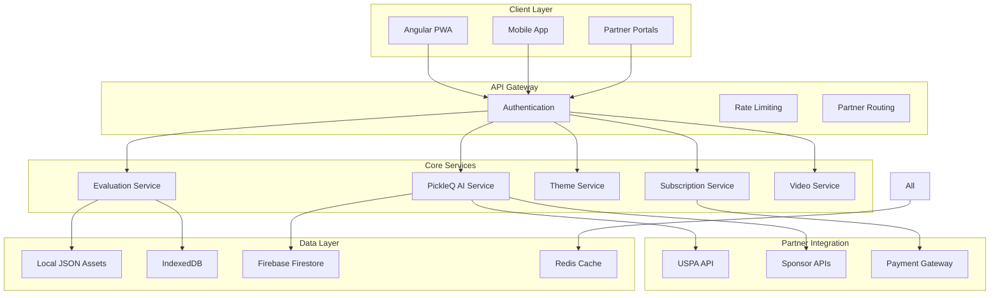

# PickleIQ Technical Architecture

## Sports Theme, AI Integration, and Partnership-Ready Platform

**Document Version**: 1.0
**Created**: September 2025
**Last Updated**: September 2025
**Architecture Type**: Microservices with Monolithic Frontend

---

## Table of Contents

1. [System Overview](#system-overview)
2. [Sports Theme Architecture](#sports-theme-architecture)
3. [Data Migration & Storage](#data-migration--storage)
4. [PickleQ AI Assistant](#pickleq-ai-assistant)
5. [Partnership Integration](#partnership-integration)
6. [API Architecture](#api-architecture)
7. [Security & Compliance](#security--compliance)
8. [Performance & Scalability](#performance--scalability)
9. [Deployment & Infrastructure](#deployment--infrastructure)

---

## System Overview

### High-Level Architecture



### Technology Stack

| Layer                | Technology           | Purpose                  | Version |
| -------------------- | -------------------- | ------------------------ | ------- |
| **Frontend**         | Angular              | PWA Application          | 19.2.10 |
| **Styling**          | SCSS + Bootstrap     | Sports Theme System      | 5.2.3   |
| **State Management** | RxJS + Services      | Reactive Data Flow       | 7.8.1   |
| **Local Storage**    | Dexie.js (IndexedDB) | Offline Data             | 4.0.8   |
| **Authentication**   | angular-oauth2-oidc  | Multi-Provider Auth      | 17.0.2  |
| **Payments**         | Stripe               | Subscription Processing  | Latest  |
| **Backend**          | Node.js + Express    | API Services             | 20.x    |
| **Database**         | Firebase Firestore   | User & Analytics Data    | Latest  |
| **Cache**            | Redis                | Performance Optimization | 7.x     |
| **CDN**              | CloudFlare           | Global Asset Delivery    | Latest  |
| **Hosting**          | Vercel               | Angular Application      | Latest  |

---

## Sports Theme Architecture

### Theme System Design

```typescript
// Core Theme Service Architecture
interface ThemeArchitecture {
  // CSS Custom Properties for Dynamic Theming
  cssCustomProperties: {
    core: CSSCustomProperty[];
    sports: CSSCustomProperty[];
    partner: CSSCustomProperty[];
  };

  // Component-Based Theme System
  components: {
    buttons: SportButtonComponent[];
    cards: CourtCardComponent[];
    forms: EvaluationFormComponent[];
    navigation: SportsNavComponent[];
  };

  // Animation Framework
  animations: {
    sports: SportsAnimation[];
    transitions: ThemeTransition[];
    loading: LoadingAnimation[];
  };

  // Partner Customization
  partnerThemes: PartnerTheme[];
}
```

### CSS Architecture (SCSS + Custom Properties)

```scss
// Theme Variables Architecture
:root {
  // Core Sports Colors
  --piq-primary: #228b22; // Pickleball court green
  --piq-secondary: #ffd700; // Official pickleball yellow
  --piq-accent: #f8f8ff; // Net white
  --piq-court-blue: #4169e1; // Court accent blue
  --piq-trophy-gold: #daa520; // Achievement gold

  // Interactive States
  --piq-hover: #2aa52a; // Lightened primary
  --piq-active: #1f7a1f; // Darkened primary
  --piq-focus: rgba(34, 139, 34, 0.25); // Primary with alpha

  // Component Specifications
  --piq-border-radius: 8px;
  --piq-border-radius-lg: 12px;
  --piq-shadow: 0 2px 4px rgba(0, 0, 0, 0.1);
  --piq-shadow-lg: 0 4px 12px rgba(0, 0, 0, 0.15);

  // Typography
  --piq-font-family-primary: 'Montserrat', 'Helvetica Neue', sans-serif;
  --piq-font-family-secondary: 'Open Sans', 'Helvetica Neue', sans-serif;
  --piq-font-family-mono: 'Roboto Mono', 'Consolas', monospace;
}

// Partner Theme Overrides
:root[data-partner='uspa'] {
  --partner-primary: #003366; // USPA Navy Blue
  --partner-secondary: #ffd700; // USPA Gold
  --partner-accent: #ffffff;
  --partner-logo-space: #f8f9fa;
}

// Dark Theme Support
:root[data-theme='dark'] {
  --piq-background: #2a302d;
  --piq-surface: #3a413e;
  --piq-text-primary: #ffffff;
  --piq-text-secondary: #e8eceb;
}
```

### Sports Component Library

```typescript
// Button Components
@Component({
  selector: 'app-sports-button',
  template: `
    <button [class]="'btn-sports ' + variant + (paddle ? ' btn-paddle' : '')" [attr.aria-label]="ariaLabel">
      <fa-icon [icon]="icon" *ngIf="icon"></fa-icon>
      <ng-content></ng-content>
    </button>
  `,
  styleUrls: ['./sports-button.component.scss'],
})
export class SportsButtonComponent {
  @Input() variant: 'primary' | 'secondary' | 'trophy' = 'primary';
  @Input() paddle: boolean = false;
  @Input() icon?: IconDefinition;
  @Input() ariaLabel?: string;
}

// Court Card Component
@Component({
  selector: 'app-court-card',
  template: `
    <div class="card-court" [class.court-lines]="showLines">
      <div class="card-header" *ngIf="title">
        <h5 class="sports-title">{{ title }}</h5>
        <div class="partner-logo" *ngIf="partnerLogo">
          
        </div>
      </div>
      <div class="card-body">
        <ng-content></ng-content>
      </div>
      <div class="card-footer" *ngIf="showTrophy">
        <span class="trophy-achievement">
          <fa-icon icon="trophy"></fa-icon>
        </span>
      </div>
    </div>
  `,
  styleUrls: ['./court-card.component.scss'],
})
export class CourtCardComponent {
  @Input() title?: string;
  @Input() showLines: boolean = false;
  @Input() showTrophy: boolean = false;
  @Input() partnerLogo?: string;
  @Input() partnerName?: string;
}

// Sports Rating Component (Paddles instead of stars)
@Component({
  selector: 'app-sports-rating',
  template: `
    <div class="rating-paddles" [attr.aria-label]="'Rating: ' + value + ' out of ' + max">
      <span *ngFor="let paddle of paddles; let i = index" class="paddle-icon" [class.filled]="i < value" [class.interactive]="interactive" (click)="interactive && onPaddleClick(i + 1)" [attr.tabindex]="interactive ? 0 : -1" [attr.role]="interactive ? 'button' : 'presentation'"> 🏓 </span>
    </div>
  `,
  styleUrls: ['./sports-rating.component.scss'],
})
export class SportsRatingComponent {
  @Input() value: number = 0;
  @Input() max: number = 5;
  @Input() interactive: boolean = false;
  @Output() ratingChange = new EventEmitter<number>();

  get paddles(): number[] {
    return Array(this.max)
      .fill(0)
      .map((_, i) => i);
  }

  onPaddleClick(rating: number): void {
    if (this.interactive) {
      this.value = rating;
      this.ratingChange.emit(rating);
    }
  }
}
```

### Animation System

```scss
// Sports-themed animations
@keyframes bounce-ball {
  0%,
  20%,
  50%,
  80%,
  100% {
    transform: translateY(0);
  }
  40% {
    transform: translateY(-20px);
  }
  60% {
    transform: translateY(-10px);
  }
}

@keyframes trophy-shine {
  0% {
    transform: translateX(-100%);
  }
  100% {
    transform: translateX(100%);
  }
}

@keyframes court-slide {
  0% {
    transform: translateX(-100%);
    opacity: 0;
  }
  100% {
    transform: translateX(0);
    opacity: 1;
  }
}

// Animation classes
.loading-ball {
  animation: bounce-ball 1.4s infinite;
  background: var(--piq-secondary);
  border-radius: 50%;
  box-shadow: 0 2px 4px rgba(0, 0, 0, 0.2);
}

.trophy-achievement {
  position: relative;
  overflow: hidden;

  &::after {
    content: '';
    position: absolute;
    top: 0;
    left: 0;
    right: 0;
    bottom: 0;
    background: linear-gradient(90deg, transparent, rgba(255, 255, 255, 0.4), transparent);
    animation: trophy-shine 2s infinite;
  }
}

// Reduced motion support
@media (prefers-reduced-motion: reduce) {
  .loading-ball,
  .trophy-achievement::after,
  .court-slide {
    animation: none;
  }
}
```

---

## Data Migration & Storage

### Hybrid Data Architecture

```typescript
// Data Source Abstraction Layer
interface IDataSourceService {
  getSkills(level?: string): Observable<Skill[]>;
  getGrades(): Observable<Grade[]>;
  getEvaluationInstructions(level: string): Observable<EvaluationInstruction>;
  getTrainingVideos(skillCode?: string): Observable<TrainingVideo[]>;
  getPickleQAdvice(category: string): Observable<PickleQAdvice[]>;
}

// Implementation Classes
@Injectable({ providedIn: 'root' })
export class LocalDataService implements IDataSourceService {
  constructor(private http: HttpClient) {}

  getSkills(level?: string): Observable<Skill[]> {
    return this.http.get<Skill[]>('/assets/data/skills.json').pipe(
      map((skills) => (level ? skills.filter((s) => s.level === level) : skills)),
      catchError(this.handleError('getSkills', []))
    );
  }

  getGrades(): Observable<Grade[]> {
    return this.http.get<Grade[]>('/assets/data/grades.json').pipe(catchError(this.handleError('getGrades', [])));
  }

  private handleError<T>(operation = 'operation', result?: T) {
    return (error: any): Observable<T> => {
      console.error(`${operation} failed:`, error);
      return of(result as T);
    };
  }
}

@Injectable({ providedIn: 'root' })
export class RemoteDataService implements IDataSourceService {
  constructor(private googleSheetsService: GoogleSheetsDbService, private youtubeService: VideoService) {}

  getSkills(level?: string): Observable<Skill[]> {
    return this.googleSheetsService.get<Skill>(environment.googleSheet.spreadsheetId, environment.googleSheet.worksheetSkills, SkillAttributesMapping).pipe(
      map((skills) => (level ? skills.filter((s) => s.level === level) : skills)),
      catchError(() => this.fallbackToLocal())
    );
  }

  private fallbackToLocal(): Observable<any> {
    // Automatic fallback to local data service
    return inject(LocalDataService).getSkills();
  }
}

@Injectable({ providedIn: 'root' })
export class HybridDataService implements IDataSourceService {
  private dataSource: IDataSourceService;

  constructor(private localService: LocalDataService, private remoteService: RemoteDataService, private connectivityService: ConnectivityService) {
    // Select data source based on configuration and connectivity
    this.dataSource = this.selectDataSource();
  }

  getSkills(level?: string): Observable<Skill[]> {
    return this.dataSource.getSkills(level).pipe(
      timeout(5000), // 5 second timeout
      catchError(() => {
        // Fallback to alternative data source
        const fallbackService = this.dataSource === this.remoteService ? this.localService : this.remoteService;
        return fallbackService.getSkills(level);
      }),
      // Cache successful results
      tap((skills) => this.cacheSkills(skills))
    );
  }

  private selectDataSource(): IDataSourceService {
    if (environment.dataSource === 'local') return this.localService;
    if (environment.dataSource === 'remote') return this.remoteService;

    // Auto-detect best source
    return this.connectivityService.isOnline ? this.remoteService : this.localService;
  }

  private cacheSkills(skills: Skill[]): void {
    // Cache to IndexedDB for offline access
    this.indexedDBService.cache('skills', skills);
  }
}
```

### IndexedDB Schema (Dexie.js)

```typescript
// Database schema for offline storage
export class PickleIQDatabase extends Dexie {
  // User-generated data
  evaluations!: Table<Evaluation>;
  users!: Table<User>;
  coaches!: Table<Coach>;
  players!: Table<Player>;

  // PickleQ AI data
  pickleqSessions!: Table<PickleQSession>;
  coachingAdvice!: Table<CoachingAdvice>;

  // Partnership data
  subscriptions!: Table<Subscription>;
  partnerData!: Table<PartnerData>;
  sponsorContent!: Table<SponsorContent>;

  // Analytics data
  usageMetrics!: Table<UsageMetric>;
  partnerAnalytics!: Table<PartnerAnalytic>;

  constructor() {
    super('PickleIQDatabase');

    this.version(1).stores({
      // Core data
      evaluations: '++id, playerId, coachId, skillLevel, createdAt, status',
      users: '++id, email, userType, createdAt, isActive',
      coaches: '++id, userId, certificationLevel, specialties',
      players: '++id, userId, currentSkillLevel, targetSkillLevel',

      // PickleQ data
      pickleqSessions: '++id, userId, question, response, category, createdAt',
      coachingAdvice: '++id, category, skillCode, advice, effectiveness',

      // Partnership data
      subscriptions: '++id, userId, tier, status, partnerId, createdAt',
      partnerData: '++id, partnerId, dataType, content, lastUpdated',
      sponsorContent: '++id, sponsorId, contentType, placement, metrics',

      // Analytics
      usageMetrics: '++id, userId, action, metadata, timestamp',
      partnerAnalytics: '++id, partnerId, metric, value, date',
    });

    // Hooks for data validation and processing
    this.evaluations.hook('creating', (primKey, obj, trans) => {
      obj.createdAt = new Date();
      obj.id = this.generateUUID();
    });

    this.pickleqSessions.hook('creating', (primKey, obj, trans) => {
      obj.createdAt = new Date();
      obj.id = this.generateUUID();

      // Track PickleQ usage for subscription limits
      this.trackPickleQUsage(obj.userId);
    });
  }

  private generateUUID(): string {
    return 'xxxxxxxx-xxxx-4xxx-yxxx-xxxxxxxxxxxx'.replace(/[xy]/g, (c) => {
      const r = (Math.random() * 16) | 0;
      const v = c === 'x' ? r : (r & 0x3) | 0x8;
      return v.toString(16);
    });
  }

  private async trackPickleQUsage(userId: string): Promise<void> {
    const currentMonth = new Date().toISOString().substring(0, 7);
    const usage = await this.usageMetrics
      .where('userId')
      .equals(userId)
      .and((metric) => metric.action === 'pickleq_query' && metric.timestamp.toISOString().startsWith(currentMonth))
      .count();

    // Check subscription limits
    const subscription = await this.subscriptions
      .where('userId')
      .equals(userId)
      .and((sub) => sub.status === 'active')
      .first();

    if (subscription && this.exceedsUsageLimit(subscription.tier, usage)) {
      throw new Error('PickleQ usage limit exceeded for current subscription tier');
    }
  }

  private exceedsUsageLimit(tier: string, usage: number): boolean {
    const limits = {
      starter: 25,
      pro: -1, // unlimited
      coach: -1, // unlimited
    };

    const limit = limits[tier as keyof typeof limits];
    return limit !== -1 && usage >= limit;
  }
}
```

### Asset File Structure

```
src/assets/data/
├── core/                           # Core evaluation data
│   ├── skills.json                 # All skill definitions
│   ├── grades.json                 # A/B/C/D grading criteria
│   └── evaluation-instructions.json # Level-specific instructions
├── pickleq/                        # PickleQ AI content
│   ├── technique-advice.json       # Technique coaching templates
│   ├── strategy-advice.json        # Strategy coaching templates
│   ├── mental-game-advice.json     # Mental coaching templates
│   ├── equipment-advice.json       # Equipment recommendations
│   └── training-programs.json      # Structured training plans
├── training/                       # Training content
│   ├── videos.json                 # Curated video metadata
│   ├── drills.json                 # Practice drill descriptions
│   └── progressions.json           # Skill progression pathways
├── partners/                       # Partner-specific content
│   ├── uspa/                       # USPA content
│   │   ├── skills.json             # USPA skill variations
│   │   ├── certifications.json     # Coaching certifications
│   │   ├── tournaments.json        # Tournament preparation
│   │   └── exclusive-content.json  # Member-only content
│   └── sponsors/                   # Sponsor content
│       ├── paddle-catalog.json     # Equipment catalog
│       ├── product-reviews.json    # Product reviews/ratings
│       └── manufacturer-content.json # Marketing content
└── i18n/                          # Internationalization
    ├── en/                        # English content
    ├── es/                        # Spanish content
    ├── fr/                        # French content
    ├── de/                        # German content
    └── pt/                        # Portuguese content
```

---

## PickleQ AI Assistant

### AI Architecture Overview

```typescript
// PickleQ Service Architecture
@Injectable({ providedIn: 'root' })
export class PickleQService {
  private aiProvider: AIProvider;
  private subscriptionService: SubscriptionService;
  private analyticsService: AnalyticsService;

  constructor(private http: HttpClient, private db: PickleIQDatabase, private partnerService: PartnerService) {}

  async askPickleQ(request: PickleQRequest): Promise<PickleQResponse> {
    // 1. Validate subscription and usage limits
    await this.validateSubscription(request.userId);

    // 2. Gather context for personalized advice
    const context = await this.gatherContext(request);

    // 3. Generate AI-powered advice
    const advice = await this.generateAdvice(request, context);

    // 4. Enhance with partner-specific content
    const enhancedAdvice = await this.enhanceWithPartnerContent(advice, context);

    // 5. Track usage and analytics
    await this.trackUsage(request, enhancedAdvice);

    return enhancedAdvice;
  }

  private async gatherContext(request: PickleQRequest): Promise<PickleQContext> {
    const [evaluations, player, subscription, partnerData] = await Promise.all([this.getRecentEvaluations(request.userId), this.getPlayerProfile(request.userId), this.getSubscription(request.userId), this.getPartnerData(request.userId)]);

    return {
      recentEvaluations,
      player,
      subscription,
      partnerData,
      weakAreas: this.identifyWeakAreas(evaluations),
      skillLevel: player.currentSkillLevel,
      preferences: player.preferences,
    };
  }

  private async generateAdvice(request: PickleQRequest, context: PickleQContext): Promise<PickleQAdvice> {
    // Phase 1: Template-based advice (human-curated)
    const templateAdvice = await this.getTemplateAdvice(request, context);

    // Phase 2: AI-enhanced advice (future implementation)
    // const aiAdvice = await this.aiProvider.generateAdvice(request, context);

    return {
      advice: templateAdvice.advice,
      category: this.categorizeQuestion(request.question),
      confidence: templateAdvice.confidence,
      trainingVideos: await this.getRecommendedVideos(request, context),
      drillRecommendations: await this.getRecommendedDrills(request, context),
      followUpQuestions: templateAdvice.followUpQuestions,
      improvementPlan: await this.generateImprovementPlan(context),
    };
  }

  private async enhanceWithPartnerContent(advice: PickleQAdvice, context: PickleQContext): Promise<PickleQResponse> {
    const enhancements = await Promise.all([this.addUSPAContent(advice, context), this.addSponsorRecommendations(advice, context), this.addCertificationPaths(advice, context)]);

    return {
      ...advice,
      uspaContent: enhancements[0],
      sponsorRecommendations: enhancements[1],
      certificationPaths: enhancements[2],
    };
  }
}

// PickleQ Data Models
interface PickleQRequest {
  userId: string;
  question: string;
  category?: 'technique' | 'strategy' | 'mental' | 'training' | 'equipment';
  context?: {
    currentEvaluation?: Evaluation;
    specificSkill?: string;
    timeframe?: string;
    goals?: string[];
  };
}

interface PickleQResponse {
  id: string;
  advice: string;
  category: string;
  confidence: number; // 0-1 scale

  // Recommendations
  trainingVideos: VideoRecommendation[];
  drillRecommendations: DrillRecommendation[];
  improvementPlan: ImprovementPlan;
  followUpQuestions: string[];

  // Partner enhancements
  uspaContent?: USPAContent;
  sponsorRecommendations?: SponsorRecommendation[];
  certificationPaths?: CertificationPath[];

  // Metadata
  createdAt: Date;
  responseTime: number; // milliseconds
  partnerAttribution?: string;
}

interface PickleQContext {
  recentEvaluations: Evaluation[];
  player: Player;
  subscription: Subscription;
  partnerData: PartnerData;
  weakAreas: string[];
  skillLevel: number;
  preferences: PlayerPreferences;
}
```

### AI Processing Pipeline

```typescript
// Template-based advice system (Phase 1)
export class TemplateAdviceEngine {
  private templates: Map<string, AdviceTemplate[]> = new Map();

  constructor() {
    this.loadAdviceTemplates();
  }

  async generateAdvice(request: PickleQRequest, context: PickleQContext): Promise<PickleQAdvice> {
    // 1. Analyze question to determine category and intent
    const analysis = await this.analyzeQuestion(request.question);

    // 2. Find relevant templates based on context
    const candidates = this.findCandidateTemplates(analysis, context);

    // 3. Select best template based on player profile
    const selectedTemplate = this.selectBestTemplate(candidates, context);

    // 4. Personalize template with player-specific data
    const personalizedAdvice = this.personalizeTemplate(selectedTemplate, context);

    // 5. Enhance with multimedia recommendations
    const enhancedAdvice = await this.enhanceWithMedia(personalizedAdvice, context);

    return enhancedAdvice;
  }

  private analyzeQuestion(question: string): QuestionAnalysis {
    // Natural language processing to understand intent
    const keywords = this.extractKeywords(question);
    const category = this.categorizeByKeywords(keywords);
    const skillCodes = this.identifySkillCodes(keywords);
    const intent = this.determineIntent(question, keywords);

    return {
      category,
      skillCodes,
      intent,
      keywords,
      confidence: this.calculateConfidence(keywords, category),
    };
  }

  private findCandidateTemplates(analysis: QuestionAnalysis, context: PickleQContext): AdviceTemplate[] {
    const categoryTemplates = this.templates.get(analysis.category) || [];

    return categoryTemplates.filter((template) => {
      // Filter by skill level appropriateness
      if (template.minSkillLevel > context.skillLevel) return false;
      if (template.maxSkillLevel < context.skillLevel) return false;

      // Filter by skill code relevance
      if (analysis.skillCodes.length > 0 && !template.applicableSkills.some((skill) => analysis.skillCodes.includes(skill))) {
        return false;
      }

      // Filter by partner compatibility
      if (context.partnerData && !template.partnerCompatible.includes(context.partnerData.partnerId)) {
        return false;
      }

      return true;
    });
  }

  private personalizeTemplate(template: AdviceTemplate, context: PickleQContext): string {
    let advice = template.content;

    // Replace placeholders with player-specific data
    advice = advice.replace(/\{playerName\}/g, context.player.name);
    advice = advice.replace(/\{skillLevel\}/g, context.skillLevel.toString());
    advice = advice.replace(/\{weakAreas\}/g, context.weakAreas.join(', '));

    // Add context-specific recommendations
    if (context.recentEvaluations.length > 0) {
      const latestEval = context.recentEvaluations[0];
      const improvementAreas = this.getImprovementAreas(latestEval);
      advice += this.generateImprovementSuggestions(improvementAreas);
    }

    return advice;
  }
}

// Advanced AI processing (Phase 2 - Future Implementation)
export class AIAdviceEngine {
  private aiModel: AIModel;
  private vectorDatabase: VectorDatabase;

  async generateAdvice(request: PickleQRequest, context: PickleQContext): Promise<PickleQAdvice> {
    // 1. Convert context to vector embeddings
    const contextVector = await this.vectorizeContext(context);

    // 2. Find similar coaching scenarios in vector database
    const similarScenarios = await this.vectorDatabase.findSimilar(contextVector, 10);

    // 3. Generate advice using AI model with similar scenarios as context
    const aiResponse = await this.aiModel.generateText({
      prompt: this.buildPrompt(request, context, similarScenarios),
      maxTokens: 500,
      temperature: 0.7,
    });

    // 4. Validate and enhance AI response
    const validatedAdvice = await this.validateAdvice(aiResponse, context);

    return validatedAdvice;
  }

  private buildPrompt(request: PickleQRequest, context: PickleQContext, similarScenarios: Scenario[]): string {
    return `
You are PickleQ, an expert pickleball coaching AI assistant.

Player Context:
- Skill Level: ${context.skillLevel}
- Recent Weak Areas: ${context.weakAreas.join(', ')}
- Goals: ${context.player.goals?.join(', ') || 'General improvement'}

Question: "${request.question}"

Similar Coaching Scenarios:
${similarScenarios.map((s) => `- ${s.situation}: ${s.advice}`).join('\n')}

Provide specific, actionable coaching advice that addresses the player's question
while considering their skill level and recent evaluation results. Include:
1. Direct answer to the question
2. Specific practice recommendations
3. Common mistakes to avoid
4. Next steps for improvement

Keep advice concise but comprehensive, appropriate for a ${context.skillLevel} level player.
    `;
  }
}
```

### Subscription & Usage Tracking

```typescript
// Subscription management for PickleQ access
@Injectable({ providedIn: 'root' })
export class PickleQSubscriptionService {
  constructor(private db: PickleIQDatabase, private stripeService: StripeService, private partnerService: PartnerService) {}

  async validatePickleQAccess(userId: string): Promise<PickleQAccessResult> {
    const subscription = await this.getCurrentSubscription(userId);

    if (!subscription) {
      return {
        hasAccess: false,
        reason: 'No active subscription',
        upgradeOptions: await this.getUpgradeOptions(userId),
      };
    }

    if (subscription.tier === 'free') {
      return {
        hasAccess: false,
        reason: 'PickleQ requires paid subscription',
        upgradeOptions: await this.getUpgradeOptions(userId),
      };
    }

    // Check usage limits for starter tier
    if (subscription.tier === 'starter') {
      const currentUsage = await this.getCurrentMonthUsage(userId);
      if (currentUsage >= 25) {
        return {
          hasAccess: false,
          reason: 'Monthly PickleQ limit exceeded',
          currentUsage,
          limit: 25,
          upgradeOptions: await this.getUpgradeOptions(userId),
        };
      }
    }

    return {
      hasAccess: true,
      subscription,
      remainingQuestions: subscription.tier === 'starter' ? 25 - (await this.getCurrentMonthUsage(userId)) : -1,
    };
  }

  async trackPickleQUsage(userId: string, question: string, response: PickleQResponse): Promise<void> {
    // Record usage for billing and analytics
    await this.db.usageMetrics.add({
      userId,
      action: 'pickleq_query',
      metadata: {
        category: response.category,
        confidence: response.confidence,
        responseTime: response.responseTime,
        partnerAttribution: response.partnerAttribution,
      },
      timestamp: new Date(),
    });

    // Update subscription usage counters
    await this.updateSubscriptionUsage(userId);

    // Track partner attribution for revenue sharing
    if (response.partnerAttribution) {
      await this.partnerService.trackPartnerUsage(response.partnerAttribution, 'pickleq_advice_generated', { userId, category: response.category });
    }
  }

  private async getUpgradeOptions(userId: string): Promise<UpgradeOption[]> {
    const currentTier = await this.getCurrentTier(userId);
    const partnerDiscounts = await this.getPartnerDiscounts(userId);

    const options: UpgradeOption[] = [];

    if (currentTier !== 'starter') {
      options.push({
        tier: 'starter',
        price: 14.99,
        features: ['25 PickleQ questions/month', 'Basic AI coaching'],
        discount: partnerDiscounts.starter,
      });
    }

    if (currentTier !== 'pro') {
      options.push({
        tier: 'pro',
        price: 24.99,
        features: ['Unlimited PickleQ', 'Advanced coaching', 'Video analysis'],
        discount: partnerDiscounts.pro,
      });
    }

    return options;
  }
}
```

---

## Partnership Integration

### USPA Integration Architecture

```typescript
// USPA API Integration
@Injectable({ providedIn: 'root' })
export class USPAIntegrationService {
  private baseUrl = environment.uspa.apiUrl;

  constructor(private http: HttpClient, private authService: AuthService, private revenueService: RevenueShareService) {}

  // Member authentication and verification
  async authenticateMember(credentials: USPACredentials): Promise<USPAMember> {
    const response = await this.http.post<USPAMemberResponse>(`${this.baseUrl}/auth/member`, credentials).toPromise();

    if (response.success) {
      // Store USPA member data for revenue sharing
      await this.storeMemberData(response.member);

      // Apply USPA member benefits
      await this.applyMemberBenefits(response.member);

      return response.member;
    }

    throw new Error(response.error || 'USPA authentication failed');
  }

  // Coaching certification verification
  async verifyCertification(coachId: string): Promise<USPACertification> {
    const response = await this.http.get<USPACertificationResponse>(`${this.baseUrl}/certifications/${coachId}`).toPromise();

    return {
      level: response.level,
      expiryDate: new Date(response.expiryDate),
      specialties: response.specialties,
      isValid: response.isValid && new Date(response.expiryDate) > new Date(),
    };
  }

  // Get USPA-approved content
  async getApprovedContent(contentType: ContentType): Promise<USPAContent[]> {
    const response = await this.http
      .get<USPAContentResponse>(`${this.baseUrl}/content/${contentType}`, {
        headers: this.getAuthHeaders(),
      })
      .toPromise();

    return response.content.map((item) => ({
      ...item,
      partnerAttribution: 'uspa',
    }));
  }

  // Revenue tracking for partnership
  async trackRevenue(subscription: Subscription): Promise<void> {
    if (subscription.partnerId === 'uspa') {
      await this.revenueService.recordPartnerRevenue({
        partnerId: 'uspa',
        subscriptionId: subscription.id,
        amount: subscription.amount * 0.3, // 30% to USPA
        currency: subscription.currency,
        period: subscription.billingPeriod,
        timestamp: new Date(),
      });
    }
  }

  private async applyMemberBenefits(member: USPAMember): Promise<void> {
    // Apply 25% discount on subscriptions
    const discount = {
      userId: member.userId,
      type: 'percentage',
      value: 25,
      code: 'USPA_MEMBER',
      description: 'USPA Member Discount',
      validUntil: new Date(Date.now() + 365 * 24 * 60 * 60 * 1000), // 1 year
    };

    await this.db.discounts.add(discount);

    // Grant access to USPA exclusive content
    await this.grantUSPAAccess(member.userId);
  }
}

// Sponsor Integration Service
@Injectable({ providedIn: 'root' })
export class SponsorIntegrationService {
  constructor(private http: HttpClient, private analyticsService: AnalyticsService) {}

  // Get product catalog from sponsors
  async getProductCatalog(category: ProductCategory): Promise<SponsorProduct[]> {
    const sponsors = await this.getActiveSponsorsByCategory(category);

    const catalogs = await Promise.all(sponsors.map((sponsor) => this.fetchSponsorCatalog(sponsor, category)));

    return catalogs.flat().sort((a, b) => {
      // Prioritize by sponsor tier
      const tierPriority = { tier1: 3, tier2: 2, tier3: 1 };
      return tierPriority[b.sponsorTier] - tierPriority[a.sponsorTier];
    });
  }

  // Track sponsor content engagement
  async trackSponsorEngagement(sponsorId: string, userId: string, engagement: SponsorEngagement): Promise<void> {
    await this.analyticsService.trackEvent({
      category: 'sponsor_engagement',
      action: engagement.type,
      label: sponsorId,
      value: engagement.value,
      metadata: {
        userId,
        productId: engagement.productId,
        placement: engagement.placement,
        timestamp: new Date(),
      },
    });

    // Update sponsor performance metrics
    await this.updateSponsorMetrics(sponsorId, engagement);
  }

  // Revenue attribution for sponsor-driven conversions
  async attributeConversion(userId: string, productId: string, sponsorId: string, conversionValue: number): Promise<void> {
    await this.db.partnerAnalytics.add({
      partnerId: sponsorId,
      metric: 'conversion',
      value: conversionValue,
      metadata: {
        userId,
        productId,
        timestamp: new Date(),
      },
      date: new Date(),
    });

    // Calculate sponsor commission (if applicable)
    const commission = await this.calculateSponsorCommission(sponsorId, conversionValue);

    if (commission > 0) {
      await this.recordSponsorCommission(sponsorId, commission);
    }
  }
}
```

### Revenue Sharing Architecture

```typescript
// Automated revenue sharing system
@Injectable({ providedIn: 'root' })
export class RevenueShareService {
  constructor(private stripeService: StripeService, private partnerService: PartnerService, private analyticsService: AnalyticsService) {}

  // Process monthly revenue sharing
  async processMonthlyRevenue(month: string, year: number): Promise<RevenueReport> {
    const period = `${year}-${month.padStart(2, '0')}`;

    // Get all partner revenue for the period
    const partnerRevenue = await this.calculatePartnerRevenue(period);

    // Process USPA revenue share (30% of member subscriptions)
    const uspaShare = await this.processUSPARevenue(partnerRevenue.uspa);

    // Process sponsor commissions
    const sponsorCommissions = await this.processSponsorCommissions(partnerRevenue.sponsors);

    // Generate payout instructions
    const payouts = await this.generatePayouts([uspaShare, ...sponsorCommissions]);

    // Record revenue sharing transactions
    await this.recordRevenueSharing(period, payouts);

    return {
      period,
      totalRevenue: partnerRevenue.total,
      partnerShares: payouts,
      pickleiqRetention: partnerRevenue.total - payouts.reduce((sum, p) => sum + p.amount, 0),
    };
  }

  private async calculatePartnerRevenue(period: string): Promise<PartnerRevenueBreakdown> {
    // Query subscription revenue by partner attribution
    const subscriptions = await this.db.subscriptions
      .where('createdAt')
      .between(new Date(`${period}-01`), new Date(`${period}-31`))
      .toArray();

    const uspaRevenue = subscriptions.filter((sub) => sub.partnerId === 'uspa').reduce((sum, sub) => sum + sub.amount, 0);

    const sponsorRevenue = await this.calculateSponsorRevenue(period);

    return {
      total: subscriptions.reduce((sum, sub) => sum + sub.amount, 0),
      uspa: uspaRevenue,
      sponsors: sponsorRevenue,
      organic: subscriptions.filter((sub) => !sub.partnerId).reduce((sum, sub) => sum + sub.amount, 0),
    };
  }

  private async processUSPARevenue(revenue: number): Promise<PartnerPayout> {
    const uspaShare = revenue * 0.3; // 30% to USPA

    return {
      partnerId: 'uspa',
      partnerName: 'USA Pickleball Association',
      amount: uspaShare,
      currency: 'USD',
      type: 'revenue_share',
      percentage: 30,
      calculationBase: revenue,
      payoutMethod: 'bank_transfer',
      bankDetails: await this.getUSPABankDetails(),
    };
  }

  // Automated payout processing
  async executePayouts(payouts: PartnerPayout[]): Promise<PayoutResult[]> {
    const results: PayoutResult[] = [];

    for (const payout of payouts) {
      try {
        let result: PayoutResult;

        switch (payout.payoutMethod) {
          case 'stripe_transfer':
            result = await this.processStripeTransfer(payout);
            break;
          case 'bank_transfer':
            result = await this.processBankTransfer(payout);
            break;
          case 'commission_credit':
            result = await this.processCommissionCredit(payout);
            break;
          default:
            throw new Error(`Unsupported payout method: ${payout.payoutMethod}`);
        }

        results.push(result);

        // Track successful payout
        await this.trackPayoutSuccess(payout, result);
      } catch (error) {
        const failureResult: PayoutResult = {
          partnerId: payout.partnerId,
          success: false,
          error: error.message,
          amount: payout.amount,
          retryAt: new Date(Date.now() + 24 * 60 * 60 * 1000), // Retry in 24 hours
        };

        results.push(failureResult);

        // Track payout failure for retry
        await this.trackPayoutFailure(payout, error);
      }
    }

    return results;
  }
}
```

---

## API Architecture

### RESTful API Design

```typescript
// API Route Structure
const apiRoutes = {
  // Core evaluation APIs
  '/api/v1/evaluations': {
    GET: 'List evaluations with filtering',
    POST: 'Create new evaluation',
    '/:id': {
      GET: 'Get evaluation by ID',
      PUT: 'Update evaluation',
      DELETE: 'Delete evaluation'
    }
  },

  // PickleQ AI Assistant APIs
  '/api/v1/pickleq': {
    POST: '/ask': 'Submit question to PickleQ',
    GET: '/history/:userId': 'Get PickleQ conversation history',
    GET: '/analytics/:userId': 'Get PickleQ usage analytics'
  },

  // Subscription Management APIs
  '/api/v1/subscriptions': {
    POST: 'Create subscription',
    GET: '/:userId': 'Get user subscription',
    PUT: '/:id/upgrade': 'Upgrade subscription',
    DELETE: '/:id/cancel': 'Cancel subscription'
  },

  // Partner Integration APIs
  '/api/v1/partners': {
    '/uspa': {
      POST: '/auth': 'Authenticate USPA member',
      GET: '/content/:type': 'Get USPA-approved content',
      GET: '/certifications/:coachId': 'Verify coaching certification'
    },
    '/sponsors': {
      GET: '/catalog/:category': 'Get sponsor product catalog',
      POST: '/engagement': 'Track sponsor engagement',
      POST: '/conversion': 'Report conversion attribution'
    }
  },

  // Analytics & Reporting APIs
  '/api/v1/analytics': {
    GET: '/revenue/:period': 'Revenue analytics by period',
    GET: '/partners/:partnerId': 'Partner-specific analytics',
    POST: '/events': 'Track custom analytics events'
  }
};

// API Response Standards
interface APIResponse<T> {
  success: boolean;
  data?: T;
  error?: {
    code: string;
    message: string;
    details?: any;
  };
  meta?: {
    pagination?: PaginationMeta;
    totalCount?: number;
    timestamp: string;
    requestId: string;
  };
}

// Error Handling
export class APIErrorHandler {
  static handle(error: any, req: Request, res: Response): APIResponse<null> {
    const requestId = req.headers['x-request-id'] as string;

    // Log error for monitoring
    logger.error('API Error:', {
      requestId,
      path: req.path,
      method: req.method,
      error: error.message,
      stack: error.stack,
      userId: req.user?.id
    });

    // Determine error type and response
    if (error.name === 'ValidationError') {
      return {
        success: false,
        error: {
          code: 'VALIDATION_ERROR',
          message: 'Invalid request data',
          details: error.details
        },
        meta: {
          timestamp: new Date().toISOString(),
          requestId
        }
      };
    }

    if (error.name === 'SubscriptionError') {
      return {
        success: false,
        error: {
          code: 'SUBSCRIPTION_REQUIRED',
          message: 'This feature requires an active subscription',
          details: {
            currentTier: error.currentTier,
            requiredTier: error.requiredTier,
            upgradeUrl: `/upgrade?from=${error.currentTier}&to=${error.requiredTier}`
          }
        },
        meta: {
          timestamp: new Date().toISOString(),
          requestId
        }
      };
    }

    // Default server error
    return {
      success: false,
      error: {
        code: 'INTERNAL_SERVER_ERROR',
        message: 'An unexpected error occurred'
      },
      meta: {
        timestamp: new Date().toISOString(),
        requestId
      }
    };
  }
}
```

### Rate Limiting & Security

```typescript
// Rate limiting configuration
export const rateLimitConfig = {
  // General API limits
  general: {
    windowMs: 15 * 60 * 1000, // 15 minutes
    max: 1000, // Limit each IP to 1000 requests per windowMs
    message: 'Too many requests, please try again later',
  },

  // PickleQ specific limits (subscription-based)
  pickleq: {
    free: {
      windowMs: 24 * 60 * 60 * 1000, // 24 hours
      max: 0, // No PickleQ access for free tier
      message: 'PickleQ requires a paid subscription',
    },
    starter: {
      windowMs: 30 * 24 * 60 * 60 * 1000, // 30 days
      max: 25, // 25 questions per month
      message: 'Monthly PickleQ limit exceeded. Upgrade to Pro for unlimited access.',
    },
    pro: {
      windowMs: 60 * 1000, // 1 minute
      max: 60, // 1 question per minute to prevent abuse
      message: 'Please wait before submitting another question',
    },
  },

  // Partner API limits
  partners: {
    windowMs: 60 * 1000, // 1 minute
    max: 120, // Higher limits for partner integrations
    skipFailedRequests: true,
  },
};

// Authentication middleware
export class AuthenticationMiddleware {
  static async validateToken(req: Request, res: Response, next: NextFunction) {
    try {
      const token = req.headers.authorization?.replace('Bearer ', '');

      if (!token) {
        return res.status(401).json({
          success: false,
          error: {
            code: 'NO_TOKEN',
            message: 'Authentication token required',
          },
        });
      }

      // Verify JWT token
      const decoded = jwt.verify(token, process.env.JWT_SECRET!) as JWTPayload;

      // Check if user exists and is active
      const user = await UserService.findById(decoded.userId);
      if (!user || !user.isActive) {
        return res.status(401).json({
          success: false,
          error: {
            code: 'INVALID_USER',
            message: 'User account not found or inactive',
          },
        });
      }

      // Check subscription status for protected routes
      if (req.path.startsWith('/api/v1/pickleq')) {
        const subscription = await SubscriptionService.getActiveSubscription(user.id);
        if (!subscription || subscription.status !== 'active') {
          return res.status(403).json({
            success: false,
            error: {
              code: 'SUBSCRIPTION_REQUIRED',
              message: 'Active subscription required for PickleQ access',
            },
          });
        }
        req.subscription = subscription;
      }

      req.user = user;
      next();
    } catch (error) {
      return res.status(401).json({
        success: false,
        error: {
          code: 'INVALID_TOKEN',
          message: 'Invalid or expired authentication token',
        },
      });
    }
  }

  // Partner API authentication
  static async validatePartnerAccess(req: Request, res: Response, next: NextFunction) {
    const partnerId = req.params.partnerId || req.headers['x-partner-id'];
    const apiKey = req.headers['x-api-key'];

    if (!partnerId || !apiKey) {
      return res.status(401).json({
        success: false,
        error: {
          code: 'PARTNER_AUTH_REQUIRED',
          message: 'Partner ID and API key required',
        },
      });
    }

    const partner = await PartnerService.validateAPIKey(partnerId, apiKey);
    if (!partner) {
      return res.status(403).json({
        success: false,
        error: {
          code: 'INVALID_PARTNER_CREDENTIALS',
          message: 'Invalid partner credentials',
        },
      });
    }

    req.partner = partner;
    next();
  }
}
```

---

## Security & Compliance

### Data Protection & Privacy

```typescript
// GDPR Compliance Service
@Injectable({ providedIn: 'root' })
export class GDPRComplianceService {
  constructor(private db: PickleIQDatabase, private analyticsService: AnalyticsService) {}

  // Data export for user requests
  async exportUserData(userId: string): Promise<UserDataExport> {
    const [user, evaluations, pickleqSessions, subscriptions, analytics] = await Promise.all([this.db.users.get(userId), this.db.evaluations.where('playerId').equals(userId).toArray(), this.db.pickleqSessions.where('userId').equals(userId).toArray(), this.db.subscriptions.where('userId').equals(userId).toArray(), this.db.usageMetrics.where('userId').equals(userId).toArray()]);

    return {
      personal_information: {
        user_profile: user,
        created_at: user?.createdAt,
        last_updated: user?.updatedAt,
      },
      evaluation_data: evaluations.map((eval) => ({
        ...eval,
        // Remove coach-specific private notes
        coachNotes: undefined,
      })),
      pickleq_conversations: pickleqSessions.map((session) => ({
        question: session.question,
        response: session.response,
        category: session.category,
        created_at: session.createdAt,
      })),
      subscription_history: subscriptions,
      usage_analytics: analytics.filter(
        (metric) =>
          // Only include user's own analytics, not partner attribution data
          !metric.metadata?.partnerId
      ),
      export_date: new Date().toISOString(),
      retention_period: '7 years from account closure',
    };
  }

  // Data deletion (right to be forgotten)
  async deleteUserData(userId: string, reason: string): Promise<DeletionReport> {
    const deletionId = this.generateDeletionId();

    try {
      // 1. Export data for compliance records
      const exportedData = await this.exportUserData(userId);
      await this.archiveExportedData(deletionId, exportedData);

      // 2. Anonymize or delete personal data
      await this.anonymizeUserData(userId);

      // 3. Update partner revenue sharing (maintain financial records)
      await this.updatePartnerRecords(userId, 'anonymized');

      // 4. Log deletion for audit trail
      await this.logDataDeletion(deletionId, userId, reason);

      return {
        deletionId,
        status: 'completed',
        deletedAt: new Date(),
        dataTypesDeleted: ['personal_information', 'evaluation_data', 'pickleq_conversations', 'usage_analytics'],
        retainedData: [
          'anonymized_subscription_history', // For financial compliance
          'anonymized_partner_analytics', // For revenue sharing accuracy
        ],
      };
    } catch (error) {
      await this.logDeletionFailure(deletionId, userId, error);
      throw new Error(`Data deletion failed: ${error.message}`);
    }
  }

  private async anonymizeUserData(userId: string): Promise<void> {
    const anonymizedId = `anon_${this.generateAnonymousId()}`;

    // Anonymize user record
    await this.db.users.update(userId, {
      email: `${anonymizedId}@anonymized.local`,
      name: 'Anonymized User',
      phone: null,
      profilePicture: null,
      isAnonymized: true,
      anonymizedAt: new Date(),
    });

    // Anonymize evaluations (keep skill data for research)
    await this.db.evaluations
      .where('playerId')
      .equals(userId)
      .modify({
        playerName: 'Anonymized Player',
        playerEmail: `${anonymizedId}@anonymized.local`,
        notes: null,
      });

    // Anonymize PickleQ sessions
    await this.db.pickleqSessions.where('userId').equals(userId).modify({
      question: '[Anonymized Question]',
      response: '[Anonymized Response]',
    });
  }
}

// PCI DSS Compliance for Payment Processing
export class PaymentSecurityService {
  // All payment processing through Stripe (PCI Level 1 compliant)
  // No payment card data stored locally

  static validatePaymentSecurity(): SecurityCheckResult {
    return {
      pciCompliant: true,
      tokenizedPayments: true,
      encryptedTransmission: true,
      secureStorage: 'No payment data stored locally',
      auditTrail: true,
      fraudDetection: true,
    };
  }

  // Secure webhook verification
  static verifyStripeWebhook(payload: string, signature: string): boolean {
    try {
      const event = stripe.webhooks.constructEvent(payload, signature, process.env.STRIPE_WEBHOOK_SECRET!);
      return true;
    } catch (error) {
      logger.error('Webhook signature verification failed:', error);
      return false;
    }
  }
}
```

### Content Security Policy

```typescript
// Security headers and CSP configuration
export const securityConfig = {
  contentSecurityPolicy: {
    directives: {
      defaultSrc: ["'self'"],
      scriptSrc: [
        "'self'",
        "'unsafe-inline'", // Required for Angular
        'https://js.stripe.com',
        'https://fonts.googleapis.com',
      ],
      styleSrc: [
        "'self'",
        "'unsafe-inline'", // Required for Angular Material
        'https://fonts.googleapis.com',
      ],
      fontSrc: ["'self'", 'https://fonts.gstatic.com', 'data:'],
      imgSrc: [
        "'self'",
        'data:',
        'https:', // Allow partner logos from HTTPS sources
        'blob:', // For generated images
      ],
      connectSrc: [
        "'self'",
        'https://api.stripe.com',
        'https://sheets.googleapis.com',
        'https://www.googleapis.com',
        'wss://', // WebSocket connections
      ],
      frameAncestors: ["'none'"], // Prevent clickjacking
      baseUri: ["'self'"],
      formAction: ["'self'"],
    },
  },

  // Additional security headers
  additionalHeaders: {
    'X-Frame-Options': 'DENY',
    'X-Content-Type-Options': 'nosniff',
    'Referrer-Policy': 'strict-origin-when-cross-origin',
    'Permissions-Policy': 'camera=(), microphone=(), geolocation=()',
    'Strict-Transport-Security': 'max-age=31536000; includeSubDomains',
  },
};
```

---

## Performance & Scalability

### Performance Optimization Strategy

```typescript
// Performance monitoring service
@Injectable({ providedIn: 'root' })
export class PerformanceMonitoringService {
  private performanceObserver: PerformanceObserver;

  constructor() {
    this.initializePerformanceMonitoring();
  }

  private initializePerformanceMonitoring(): void {
    // Core Web Vitals monitoring
    this.monitorCoreWebVitals();

    // Custom performance metrics
    this.monitorCustomMetrics();

    // Theme switching performance
    this.monitorThemePerformance();

    // PickleQ response times
    this.monitorPickleQPerformance();
  }

  private monitorCoreWebVitals(): void {
    // Largest Contentful Paint (LCP)
    new PerformanceObserver((list) => {
      for (const entry of list.getEntries()) {
        if (entry.entryType === 'largest-contentful-paint') {
          this.reportMetric('LCP', entry.startTime, {
            target: entry.element?.tagName,
            url: entry.url,
          });
        }
      }
    }).observe({ entryTypes: ['largest-contentful-paint'] });

    // First Input Delay (FID)
    new PerformanceObserver((list) => {
      for (const entry of list.getEntries()) {
        this.reportMetric('FID', entry.processingStart - entry.startTime, {
          eventType: entry.name,
        });
      }
    }).observe({ entryTypes: ['first-input'] });

    // Cumulative Layout Shift (CLS)
    let clsValue = 0;
    new PerformanceObserver((list) => {
      for (const entry of list.getEntries()) {
        if (!entry.hadRecentInput) {
          clsValue += entry.value;
        }
      }
      this.reportMetric('CLS', clsValue);
    }).observe({ entryTypes: ['layout-shift'] });
  }

  private monitorPickleQPerformance(): void {
    // Track PickleQ response times
    this.interceptPickleQRequests();
  }

  private interceptPickleQRequests(): void {
    const originalFetch = window.fetch;

    window.fetch = async (...args) => {
      const [url] = args;

      if (typeof url === 'string' && url.includes('/api/v1/pickleq')) {
        const startTime = performance.now();

        try {
          const response = await originalFetch(...args);
          const endTime = performance.now();

          this.reportMetric('PickleQ_Response_Time', endTime - startTime, {
            status: response.status,
            success: response.ok,
          });

          return response;
        } catch (error) {
          const endTime = performance.now();

          this.reportMetric('PickleQ_Response_Time', endTime - startTime, {
            status: 'error',
            success: false,
            error: error.message,
          });

          throw error;
        }
      }

      return originalFetch(...args);
    };
  }

  private reportMetric(name: string, value: number, metadata?: any): void {
    // Send to analytics service
    this.analyticsService.trackPerformance({
      metric: name,
      value,
      metadata,
      timestamp: new Date(),
      userAgent: navigator.userAgent,
      connectionType: (navigator as any).connection?.effectiveType,
      deviceMemory: (navigator as any).deviceMemory,
    });

    // Alert if performance thresholds exceeded
    this.checkPerformanceThresholds(name, value);
  }

  private checkPerformanceThresholds(metric: string, value: number): void {
    const thresholds = {
      LCP: 2500, // 2.5 seconds
      FID: 100, // 100 milliseconds
      CLS: 0.1, // 0.1 cumulative score
      PickleQ_Response_Time: 3000, // 3 seconds
    };

    const threshold = thresholds[metric as keyof typeof thresholds];

    if (threshold && value > threshold) {
      this.alertService.reportPerformanceIssue({
        metric,
        value,
        threshold,
        severity: this.calculateSeverity(value, threshold),
      });
    }
  }
}

// Code splitting and lazy loading
const routes: Routes = [
  {
    path: '',
    loadComponent: () => import('./home/home.component').then((m) => m.HomeComponent),
  },
  {
    path: 'rating',
    loadChildren: () => import('./features/rating/rating.routes').then((m) => m.ratingRoutes),
  },
  {
    path: 'pickleq',
    loadChildren: () => import('./features/pickleq/pickleq.routes').then((m) => m.pickleqRoutes),
    canActivate: [SubscriptionGuard], // Lazy load only for subscribers
  },
  {
    path: 'training',
    loadChildren: () => import('./features/training/training.routes').then((m) => m.trainingRoutes),
  },
  {
    path: 'partners',
    loadChildren: () => import('./features/partners/partners.routes').then((m) => m.partnerRoutes),
    canActivate: [PartnerGuard],
  },
];

// Image optimization service
@Injectable({ providedIn: 'root' })
export class ImageOptimizationService {
  // Lazy loading with Intersection Observer
  observeImages(): void {
    const imageObserver = new IntersectionObserver(
      (entries, observer) => {
        entries.forEach((entry) => {
          if (entry.isIntersecting) {
            const img = entry.target as HTMLImageElement;
            this.loadImage(img);
            observer.unobserve(img);
          }
        });
      },
      { rootMargin: '50px' }
    );

    // Observe all images with data-src attribute
    document.querySelectorAll('img[data-src]').forEach((img) => {
      imageObserver.observe(img);
    });
  }

  private loadImage(img: HTMLImageElement): void {
    const src = img.dataset.src;
    if (src) {
      // Use WebP format with fallback
      this.loadWebPWithFallback(img, src);
    }
  }

  private loadWebPWithFallback(img: HTMLImageElement, src: string): void {
    const webpSrc = src.replace(/\.(jpg|jpeg|png)$/i, '.webp');

    // Test WebP support
    const webpTest = new Image();
    webpTest.onload = () => {
      img.src = webpSrc;
      img.classList.add('loaded');
    };
    webpTest.onerror = () => {
      img.src = src;
      img.classList.add('loaded');
    };
    webpTest.src = 'data:image/webp;base64,UklGRhQAAABXRUJQVlA4WAoAAAAKAAAAAAAAAAAAQUxQSAwAAAAAAAAAAAAAAAA=';
  }
}
```

### Caching Strategy

```typescript
// Multi-layer caching architecture
@Injectable({ providedIn: 'root' })
export class CachingService {
  private memoryCache = new Map<string, CacheEntry>();
  private readonly CACHE_DURATION = {
    skills: 24 * 60 * 60 * 1000, // 24 hours
    grades: 24 * 60 * 60 * 1000, // 24 hours
    pickleqAdvice: 60 * 60 * 1000, // 1 hour
    partnerContent: 4 * 60 * 60 * 1000, // 4 hours
    userSubscription: 5 * 60 * 1000, // 5 minutes
  };

  constructor(private db: PickleIQDatabase, private serviceWorkerService: ServiceWorkerService) {
    this.initializeCaching();
  }

  // L1: Memory cache (fastest)
  private getFromMemory<T>(key: string): T | null {
    const entry = this.memoryCache.get(key);

    if (!entry) return null;

    if (Date.now() > entry.expiresAt) {
      this.memoryCache.delete(key);
      return null;
    }

    return entry.data;
  }

  private setInMemory<T>(key: string, data: T, ttl: number): void {
    this.memoryCache.set(key, {
      data,
      expiresAt: Date.now() + ttl,
      createdAt: Date.now(),
    });
  }

  // L2: IndexedDB cache (persistent)
  private async getFromIndexedDB<T>(key: string): Promise<T | null> {
    try {
      const cached = await this.db.cache.get(key);

      if (!cached) return null;

      if (Date.now() > cached.expiresAt) {
        await this.db.cache.delete(key);
        return null;
      }

      // Promote to memory cache
      const ttl = cached.expiresAt - Date.now();
      this.setInMemory(key, cached.data, ttl);

      return cached.data;
    } catch (error) {
      console.warn('IndexedDB cache read failed:', error);
      return null;
    }
  }

  private async setInIndexedDB<T>(key: string, data: T, ttl: number): Promise<void> {
    try {
      await this.db.cache.put({
        key,
        data,
        expiresAt: Date.now() + ttl,
        createdAt: Date.now(),
      });
    } catch (error) {
      console.warn('IndexedDB cache write failed:', error);
    }
  }

  // L3: Service Worker cache (HTTP requests)
  private async getFromServiceWorker(url: string): Promise<Response | null> {
    if (!this.serviceWorkerService.isSupported) return null;

    try {
      const cache = await caches.open('pickleiq-v1');
      return await cache.match(url);
    } catch (error) {
      console.warn('Service Worker cache read failed:', error);
      return null;
    }
  }

  // Public caching API
  async get<T>(key: string, fetcher?: () => Promise<T>): Promise<T | null> {
    // L1: Try memory cache first
    let data = this.getFromMemory<T>(key);
    if (data !== null) {
      this.trackCacheHit('memory', key);
      return data;
    }

    // L2: Try IndexedDB cache
    data = await this.getFromIndexedDB<T>(key);
    if (data !== null) {
      this.trackCacheHit('indexeddb', key);
      return data;
    }

    // L3: Fetch fresh data if fetcher provided
    if (fetcher) {
      try {
        data = await fetcher();

        if (data !== null) {
          const ttl = this.getTTL(key);
          this.setInMemory(key, data, ttl);
          await this.setInIndexedDB(key, data, ttl);
          this.trackCacheMiss(key);
        }

        return data;
      } catch (error) {
        console.error('Cache fetcher failed:', error);
        return null;
      }
    }

    this.trackCacheMiss(key);
    return null;
  }

  private getTTL(key: string): number {
    if (key.startsWith('skills:')) return this.CACHE_DURATION.skills;
    if (key.startsWith('grades:')) return this.CACHE_DURATION.grades;
    if (key.startsWith('pickleq:')) return this.CACHE_DURATION.pickleqAdvice;
    if (key.startsWith('partner:')) return this.CACHE_DURATION.partnerContent;
    if (key.startsWith('subscription:')) return this.CACHE_DURATION.userSubscription;

    return 60 * 60 * 1000; // Default 1 hour
  }

  private trackCacheHit(layer: string, key: string): void {
    this.analyticsService.trackEvent({
      category: 'cache',
      action: 'hit',
      label: `${layer}:${key}`,
      value: 1,
    });
  }

  private trackCacheMiss(key: string): void {
    this.analyticsService.trackEvent({
      category: 'cache',
      action: 'miss',
      label: key,
      value: 1,
    });
  }
}
```

---

## Deployment & Infrastructure

### Production Infrastructure

```yaml
# Docker configuration for microservices
version: '3.8'
services:
  # Angular Frontend (PWA)
  frontend:
    image: pickleiq/frontend:latest
    ports:
      - '80:80'
      - '443:443'
    environment:
      - NODE_ENV=production
      - API_BASE_URL=https://api.pickleiq.com
    volumes:
      - ./ssl:/etc/ssl/certs
    depends_on:
      - api-gateway

  # API Gateway
  api-gateway:
    image: pickleiq/api-gateway:latest
    ports:
      - '8080:8080'
    environment:
      - REDIS_URL=redis://redis:6379
      - JWT_SECRET=${JWT_SECRET}
    depends_on:
      - redis
      - pickleq-service
      - evaluation-service

  # PickleQ AI Service
  pickleq-service:
    image: pickleiq/pickleq-service:latest
    environment:
      - DATABASE_URL=${DATABASE_URL}
      - OPENAI_API_KEY=${OPENAI_API_KEY}
      - STRIPE_SECRET_KEY=${STRIPE_SECRET_KEY}
    depends_on:
      - postgres
      - redis

  # Evaluation Service
  evaluation-service:
    image: pickleiq/evaluation-service:latest
    environment:
      - DATABASE_URL=${DATABASE_URL}
      - GOOGLE_SHEETS_API_KEY=${GOOGLE_SHEETS_API_KEY}
    depends_on:
      - postgres

  # Partner Integration Service
  partner-service:
    image: pickleiq/partner-service:latest
    environment:
      - DATABASE_URL=${DATABASE_URL}
      - USPA_API_KEY=${USPA_API_KEY}
      - STRIPE_SECRET_KEY=${STRIPE_SECRET_KEY}
    depends_on:
      - postgres

  # Database
  postgres:
    image: postgres:15
    environment:
      - POSTGRES_DB=pickleiq
      - POSTGRES_USER=${DB_USER}
      - POSTGRES_PASSWORD=${DB_PASSWORD}
    volumes:
      - postgres_data:/var/lib/postgresql/data

  # Cache
  redis:
    image: redis:7-alpine
    command: redis-server --appendonly yes
    volumes:
      - redis_data:/data

volumes:
  postgres_data:
  redis_data:
```

### CI/CD Pipeline

```yaml
# GitHub Actions workflow
name: PickleIQ CI/CD Pipeline

on:
  push:
    branches: [main, develop]
  pull_request:
    branches: [main]

jobs:
  test:
    runs-on: ubuntu-latest
    steps:
      - uses: actions/checkout@v3

      - name: Setup Node.js
        uses: actions/setup-node@v3
        with:
          node-version: '20'
          cache: 'npm'

      - name: Install dependencies
        run: npm ci

      - name: Run linting
        run: npm run lint

      - name: Run unit tests
        run: npm run test:ci

      - name: Run e2e tests
        run: npm run e2e:ci

      - name: Build application
        run: npm run build:prod

      - name: Upload coverage to Codecov
        uses: codecov/codecov-action@v3

  security-scan:
    runs-on: ubuntu-latest
    steps:
      - uses: actions/checkout@v3

      - name: Run Snyk security scan
        uses: snyk/actions/node@master
        env:
          SNYK_TOKEN: ${{ secrets.SNYK_TOKEN }}

      - name: Run OWASP ZAP scan
        uses: zaproxy/action-full-scan@v0.4.0
        with:
          target: 'https://staging.pickleiq.com'

  deploy-staging:
    if: github.ref == 'refs/heads/develop'
    needs: [test, security-scan]
    runs-on: ubuntu-latest
    steps:
      - uses: actions/checkout@v3

      - name: Deploy to Vercel staging
        uses: amondnet/vercel-action@v25
        with:
          vercel-token: ${{ secrets.VERCEL_TOKEN }}
          vercel-org-id: ${{ secrets.VERCEL_ORG_ID }}
          vercel-project-id: ${{ secrets.VERCEL_PROJECT_ID }}
          working-directory: ./

  deploy-production:
    if: github.ref == 'refs/heads/main'
    needs: [test, security-scan]
    runs-on: ubuntu-latest
    steps:
      - uses: actions/checkout@v3

      - name: Deploy to Vercel production
        uses: amondnet/vercel-action@v25
        with:
          vercel-token: ${{ secrets.VERCEL_TOKEN }}
          vercel-org-id: ${{ secrets.VERCEL_ORG_ID }}
          vercel-project-id: ${{ secrets.VERCEL_PROJECT_ID }}
          vercel-args: '--prod'
          working-directory: ./

      - name: Notify partners of deployment
        run: |
          curl -X POST "${{ secrets.USPA_WEBHOOK_URL }}" \
            -H "Content-Type: application/json" \
            -d '{"event": "deployment", "version": "${{ github.sha }}", "environment": "production"}'
```

### Monitoring & Alerting

```typescript
// Application monitoring configuration
export const monitoringConfig = {
  // Error tracking
  sentry: {
    dsn: process.env.SENTRY_DSN,
    environment: process.env.NODE_ENV,
    tracesSampleRate: 0.1,
    beforeSend(event, hint) {
      // Filter out partner-sensitive information
      if (event.tags?.partner) {
        event.user = undefined;
      }
      return event;
    },
  },

  // Performance monitoring
  performance: {
    thresholds: {
      pageLoad: 3000, // 3 seconds
      apiResponse: 2000, // 2 seconds
      pickleqResponse: 5000, // 5 seconds
      themeSwitch: 500, // 500ms
    },
    sampling: {
      production: 0.1, // 10% sampling
      staging: 1.0, // 100% sampling
    },
  },

  // Business metrics
  businessMetrics: {
    subscriptionConversion: {
      target: 0.2, // 20% conversion rate
      alertThreshold: 0.15, // Alert if below 15%
    },
    pickleqUsage: {
      target: 0.8, // 80% weekly usage
      alertThreshold: 0.6, // Alert if below 60%
    },
    partnerRevenue: {
      monthlyGrowthTarget: 0.1, // 10% month-over-month
      alertThreshold: -0.05, // Alert if declining by 5%
    },
  },

  // Infrastructure monitoring
  infrastructure: {
    alerts: {
      cpuUsage: 80, // Alert at 80% CPU
      memoryUsage: 85, // Alert at 85% memory
      diskUsage: 90, // Alert at 90% disk
      responseTime: 5000, // Alert if > 5 seconds
      errorRate: 0.05, // Alert if > 5% error rate
    },
  },
};

// Health check endpoints
@Controller('health')
export class HealthController {
  @Get()
  async getHealth(): Promise<HealthStatus> {
    const [database, redis, external] = await Promise.all([this.checkDatabase(), this.checkRedis(), this.checkExternalServices()]);

    const overall = database.healthy && redis.healthy && external.healthy;

    return {
      status: overall ? 'healthy' : 'unhealthy',
      timestamp: new Date().toISOString(),
      services: {
        database,
        redis,
        external,
        pickleq: await this.checkPickleQService(),
        partners: await this.checkPartnerServices(),
      },
      version: process.env.npm_package_version,
    };
  }

  private async checkPickleQService(): Promise<ServiceHealth> {
    try {
      const startTime = Date.now();
      // Test PickleQ with a simple query
      await this.pickleqService.healthCheck();
      const responseTime = Date.now() - startTime;

      return {
        healthy: responseTime < 3000,
        responseTime,
        lastChecked: new Date().toISOString(),
      };
    } catch (error) {
      return {
        healthy: false,
        error: error.message,
        lastChecked: new Date().toISOString(),
      };
    }
  }

  private async checkPartnerServices(): Promise<PartnerServicesHealth> {
    const [uspa, stripe, google] = await Promise.all([this.checkUSPAService(), this.checkStripeService(), this.checkGoogleServices()]);

    return {
      uspa,
      stripe,
      google,
      overall: uspa.healthy && stripe.healthy && google.healthy,
    };
  }
}
```

---

This technical architecture document provides comprehensive specifications for implementing the PickleIQ transformation with sports theming, AI integration, and partnership capabilities. The architecture emphasizes performance, security, scalability, and maintainability while supporting the complex requirements of a multi-partner platform.

The modular design allows for incremental implementation and testing, ensuring each component can be developed and deployed independently while maintaining system integrity and user experience quality.
